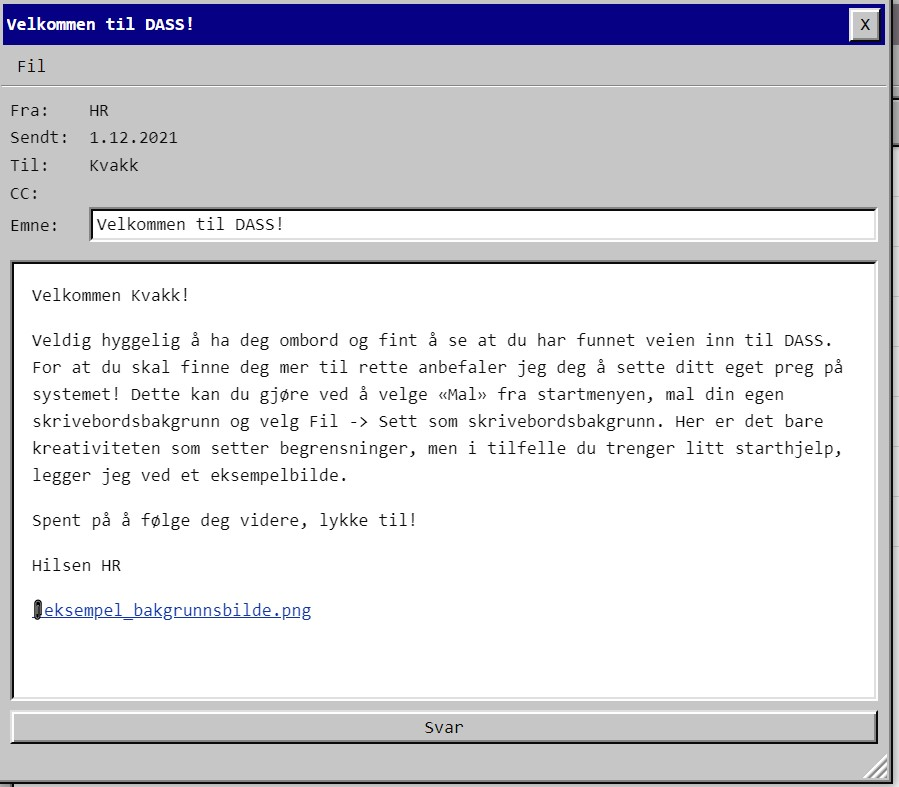
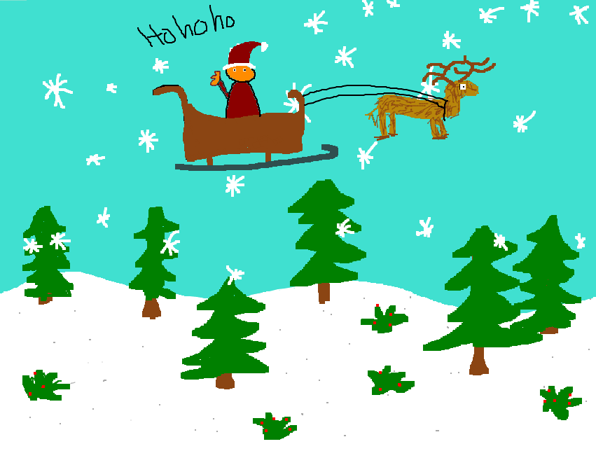
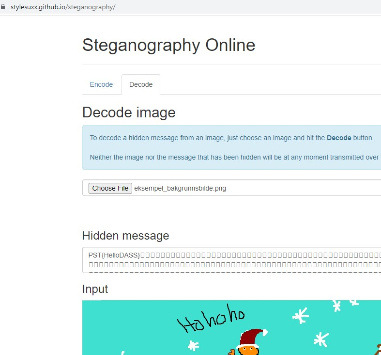

# Luke 1
Dette var kaotisk. Hadde ingen anelse om hva oppgaven var, men ryktet sa at CTFen skulle starte kl 18:00 og kl 18:00 kom det en melding i innboksen.

Men jeg ante ikke om bildet i seg selv var oppgaven, om det var noe i paint-appen eller om mailsystemet skulle angripes.

Etter en stund innså jeg at det måtte være bildet:

Prøvde usannsynlig mye ubrukelig i CyberChef uten å lykkes. Googlet online stenography, og så lett var det:

En lærepenge til senere CTFer :)
