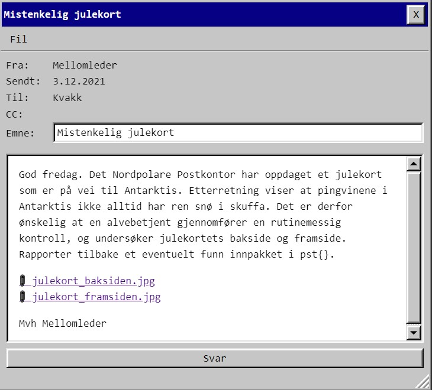
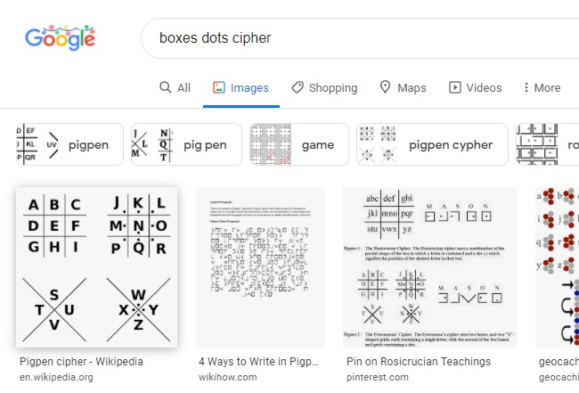
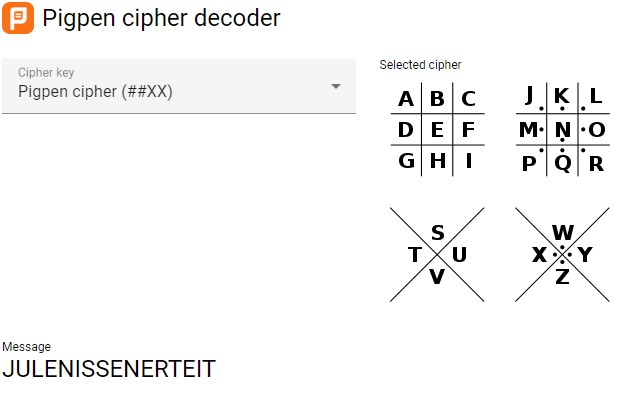

# Luke 3

Julekort med mystiske symboler. Denne var morsom!

Jeg hadde absolutt ingen idé om hva dette var for noe, så google fikk hjelpe:

Fant et online-verktøy som hjalp til med oversettingen [https://planetcalc.com/7842/](https://planetcalc.com/7842/), men bokstavene jeg fikk ut ga ikke mening. Prøvde xor med symbolene fra baksiden som nøkkel, men uten hell. Jeg innså at teksten på baksiden ble den samme om kortet var opp ned, og det ga halvveis mening siden mottakeren var "down under", så jeg prøvde å snu kortet:

    PST{julenissenerteit}