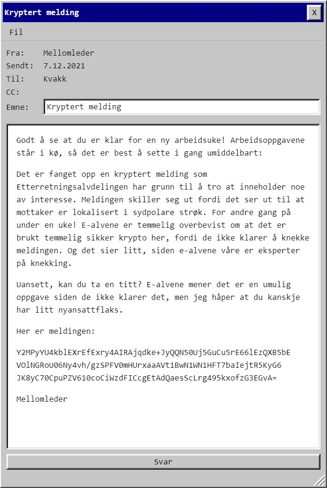
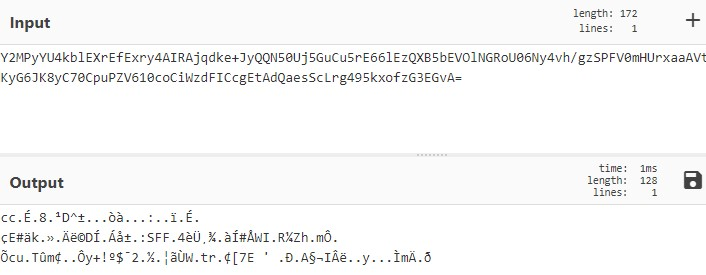
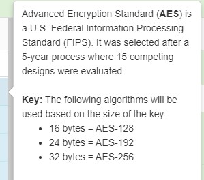
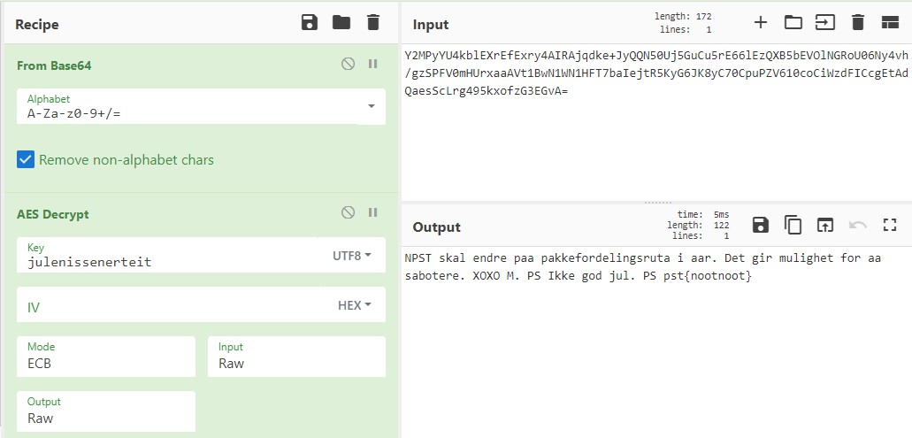

# Luke 7

Eh, ja. Det var tilsynelatende base64, men resultatet ga meg ikke spesielt mye:

Men uten mer å gå på måtte det være hint i teksten. Jeg hang meg opp i setningen "For andre gang på under en uke!" og det hinter tilbake til [Luke 3](./luke3) hvor det var ubrukte bokstaver på baksiden av julekortet. Prøvde alt mulig dumt med xor og div andre algoritmer, men kom ikke videre.

Men lengden på cipherteksten var for "rund" til å være tilfeldig:

    >>> len(data)
    128

Jeg kan ikke stort om krypto, men googling ga meg inntrykk av at dette kunne være AES128.

I cyberchef fikk jeg et annet hint om kryptoen:

Så jeg må ha en 16 byte nøkkel! Det er tilfeldigvis nøyaktig lengden på flagget fra luke 3 det:

    >>> len("julenissenerteit")
    16

    pst{nootnoot}

