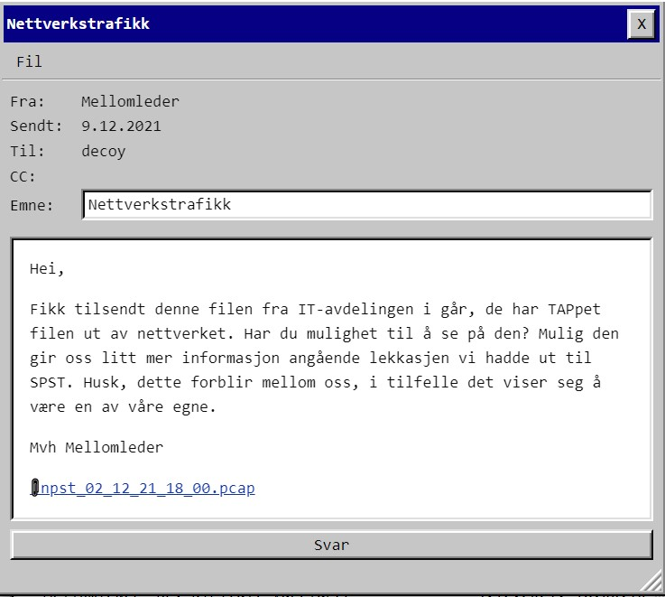
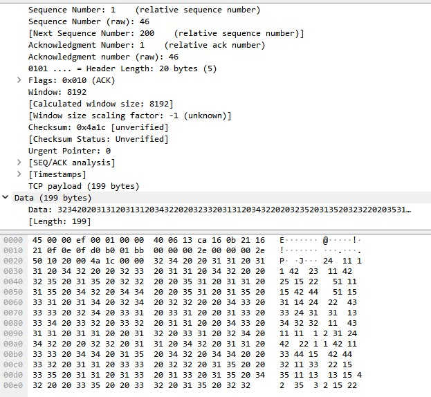

# Luke 9


En [pcap](npst_02_12_21_18_00.pcap) å kikke på altså. Fyrer den opp i wireshark, men det ser merkelig ut. Trafikk går på tcp/443, men dette er ikke normal kryptert http-trafikk.



Fant ut at jeg måtte hente ut data så jeg kunne leke med de i python i stedet. Enkleste måten jeg fant uten å lære meg å tukle med pcap i python var å eksportere pakkene som json.

Innså at ingen av tallene i teksten oversteg 55 og ingen var under 11, og det var mye repeterende tall. Hintet i mailen gikk på TAP ("TAPpet"), så jeg googlet "tap cipher":


Skrev en kjapp decoder:

```python
#!/usr/bin/env python3
import json

def tap(s):
    alphabet = ["A","B","K","D","E","F","G","H","I","J","L","M","N","O","P","Q","R","S","T","U","V","W","X","Y","Z"]
    tap = ["11", "12", "13", "14", "15", "21", "22", "23", "24", "25", "31", "32", "33", "34", "35", "41", "42", "43", "44", "45", "51", "52", "53", "54", "55"]

    out = []
    for words in s.split("  "):
        out.append("".join([alphabet[tap.index(ch)] for ch in words.split()]))
    return " ".join(out)

for p in json.load(open("pcap-export.json")):
   try:
      # Konverter fra kolon-separert hex av rådata til ascii
      data = "".join([chr(int(a, 16)) for a in p["_source"]['layers']['data']['data.data'].split(":")]) 
   except:
      # ikke alle har data-keyen.
      continue

   untapped = tap(data)
   if untapped.startswith("PST"):
      print(untapped)
)

```

Output:

    PST KROLLPARANTES F APOSTROF JEG SNAKKER MED DEG FRA KROLLPARANTES SOURKEIP KROLLPARANTES SLUTT APOSTROF KROLLPARANTES SLUTT


Prøver å poste **PST{F'JEG SNAKKER MED DEG FRA {SOURCEIP}'}**, men det gikk jo dårlig. F'' er pythonsk (og sikkert andre) for en streng hvor det inni klammene erstattes med variabelen, så jeg prøvde å fjerne F'' og putte IPen inni der uten noen apostrofer eller klammer, men det gikk heller ikke.
Prøvde egentlig mye drit, til jeg innså at også IP-ene var i tap-cipher (31.34.21.44 osv). Oppdaterte [scriptet](./parse.py) og fant ut at IPen denne pakken kom fra ble dekodet til "STUE". 

Prøvde **PST{JEG SNAKKER MED DEG FRA STUE}** Men neeeeeida - prøvde de andre IPene også (NEDE, GANG, SPST osv) uten hell.   Her måtte jeg faktisk få tips om å prøve uten mellomrom, og da gikk driten endelig. Jævla irriterende, siden mellomrom åpenbart er en del av teksten, så den slags dumskap gikk meg hus forbi.

     PST{JEGSNAKKERMEDDEGFRASTUE}


