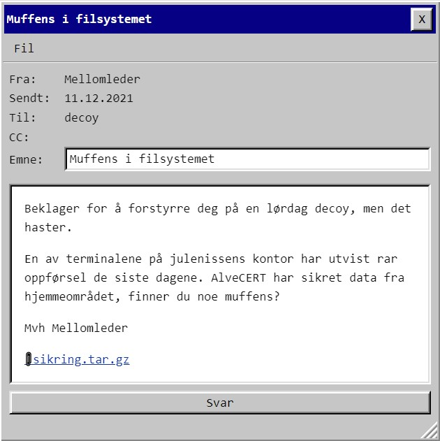

# Luke 10




Her var det et jffs2-filsystem, men oppskriftene jeg fant for å montere det virket ikke. De slemme alvene har brukt Big Endian, og det var ikke default støttet i Linuxen min. Konverterte til little endian og kjørte [script for å dumpe](https://github.com/project-magpie/jffs2dump) til filer:

    jffs2dump -v -b -r -eout sikring_alveCERT
    ./jffs2-dump.py out    

Scriptet dumpet innholdet til ./root:
```root
├── 1.jpg
├── 2.jpg
├── 3.jpg
├── 4.jpg
├── 5.jpg
└── flag.txt
```

flag.txt inneholdt bare "this is not it", så jeg regnet med det lå i bildene, men de var bare mer eller mindre søte dyr i juleantrekk. Men jeg fant en .sys-fil som så interessant ut:
```
# file root/.sys
root/.sys: Linux Compressed ROM File System data, little endian size 143360 version #2 sorted_dirs CRC 0xf37c339d, edition 0, 34 blocks, 2 files

# sudo mount -t cramfs -o loop ./sys ./cram/
# ls -l cram
total 136K
-rw-rw-r-- 1 oddrune 232 136K Jan  1  1970 guardians.jpg
```

guardians.jpg var episk i seg selv, men det var ikke noe flagg der heller. Begynte å se etter exifdata, og der var det en software-tag det luktet flagg av: **CFG{WhyrYnzn}**  En rot-13 senere hadde vi julelamaen:

    PST{JuleLama}

