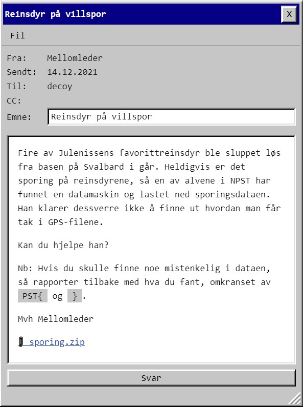
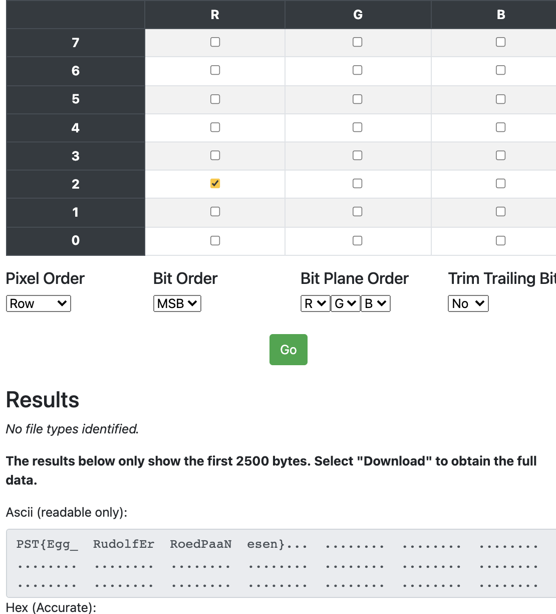

# Luke14

Zip-filen pakkes ut til :

| Fil | Beskrivelse
|-|-|
| gps.7z   | kryptert fil
| Rudolf.png | bilde av Rudolf
| lost_key.txt | tekstfil med **493** i.

Rød-2 i PNG hadde passord på 7zip-filen: **floduR123** 

KML-filen inneholdt fire sett med paths/koordinater. Plottet dem i et kart, og de hadde morse-kode i seg.

    PST{runforrestrun}

# Egg

Det samme bitplanet som hadde passordet til zipfilen inneholdt noe annet også:

    PST{Egg_RudolfErRoedPaaNesen}
    