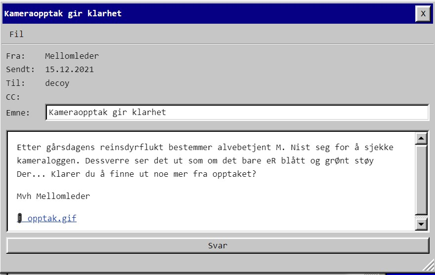

# Luke 15



GIF-fil med mangefarget snø og hint om å se på rødt. 


Fjernet blå/grønn info og hver frame har et håndskrevet tall oppe i venstre hjørne.

```python
import cv2, glob

for fname in glob.glob("*.png"):
  src = cv2.imread(fname)
  cv2.imwrite("red_" +fname, src[:,:,2])
```


Tallet er ascii-koden. Stavet meg bare gjennom.


```python
"".join([chr(int(x)) for x in "80 83 84 123 72 101 114 86 97 114 68 101 116 73 107 107 101 77 121 101 197 83 101 71 105 116 116 46 46 46 125".split()])
'PST{HerVarDetIkkeMyeÅSeGitt...}'
```


    PST{HerVarDetIkkeMyeÅSeGitt...}


