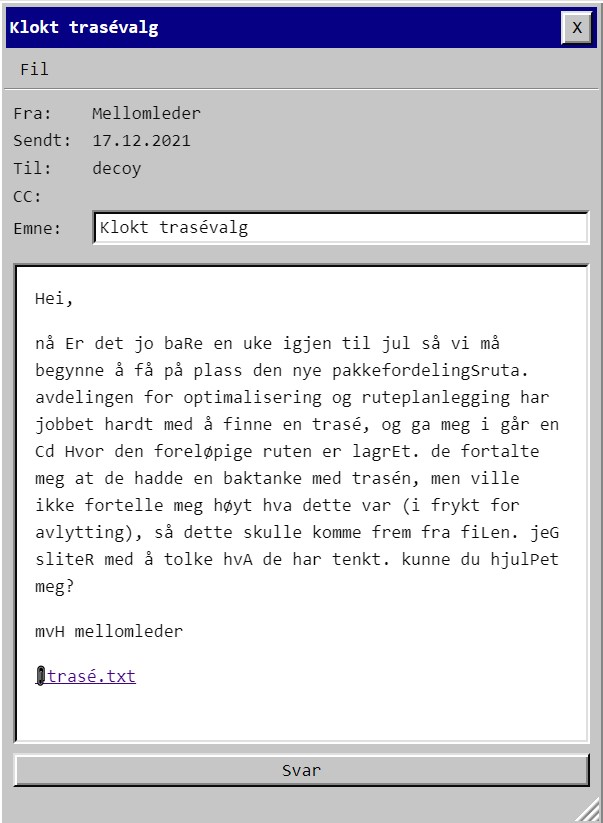
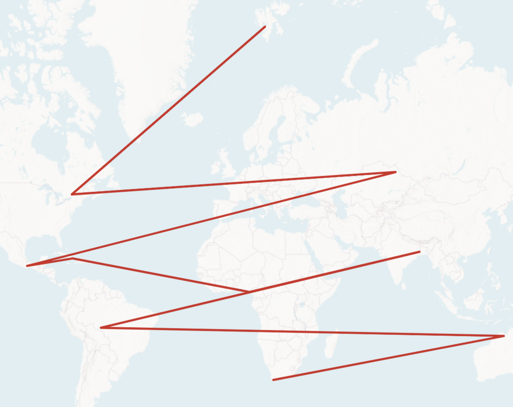

# Luke 17



```python 
"".join([ch for ch in mail if ch in string.ascii_uppercase])
'HERSCHELGRAPH'
```

Kort forklart:
1) Har ingenting med herschelgraf å gjøre
2) Ta forbokstaven byene [koordinatene](trase.txt) peker på
3) rot4 (!) - fordi det var det enkleste og dummeste som ga meg bokstavene "PST"
4) Lek med [anagram](https://ingesanagram.com/) til noe virker.

```
VKTILAPYSRS rot4
PST - VKILAYSR    får ikke noe lurt ut av dette
      ALV KIYSR   -- ikke alv i skyr 
      ALVISK YR   -- regner ikke
      SKY RIVAL   -- jackpot!

```

    PST{SKYRIVAL}


Plotter resultatet så bli det en hamiltonvei:
>"In graph theory, a branch of mathematics, the Herschel graph is a bipartite undirected graph with 11 vertices and 18 edges, the smallest non-Hamiltonian polyhedral graph." 

Så det klin motsatte?



Gleder meg til å lese writeups. Har brukt alt for mange timer på denne oppgaven. Takk for god hjelp alle som ha dratt meg ut av ville kaninhull.
