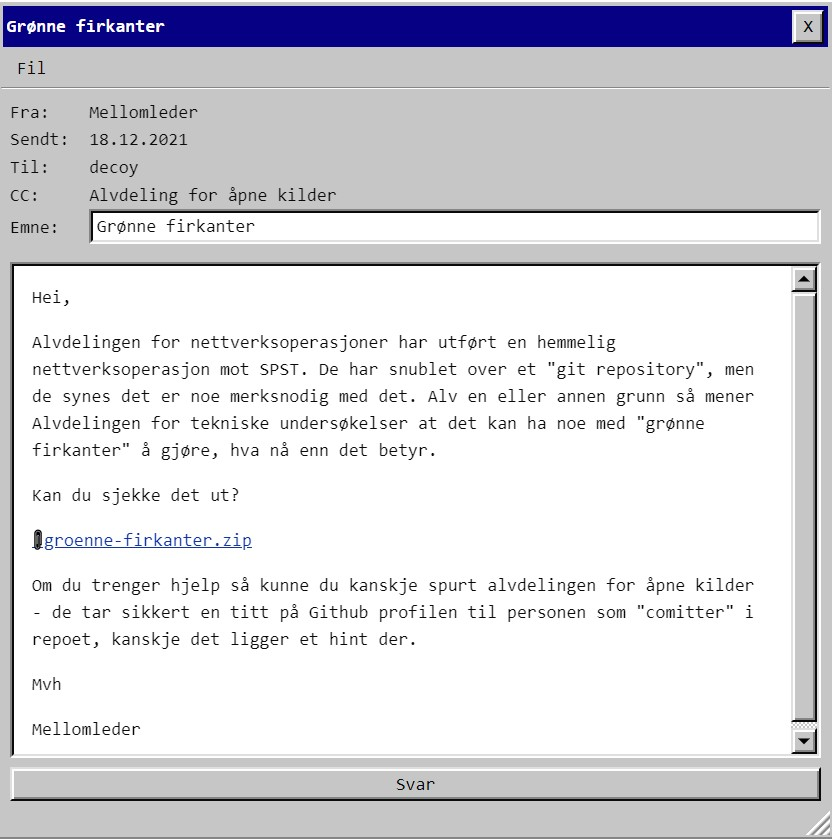
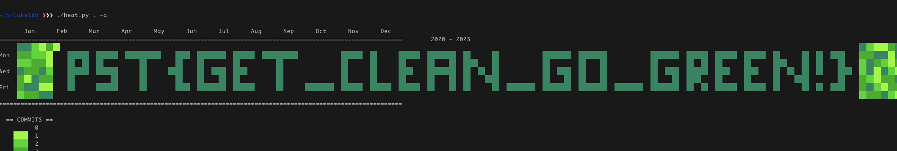

# Luke 18

Et git repository med mystisk innhold og filnavn grønne firkanter. I tillegg hint om å bruke osint for å finne ut noe om commits..

Her har de smurt tykt på med hintene :)

Lastet ned https://github.com/james-stoup/heatwave og modifiserte den til å takle datoer frem i tid:

    PST{GET_CLEAN_GO_GREEN!}

