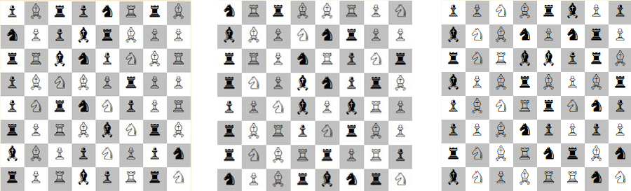
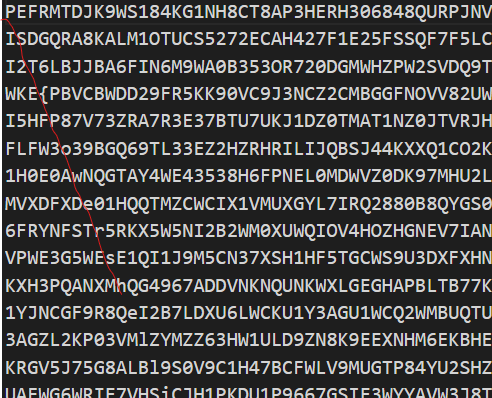

# PST påsken 2023

# Luke 1 - Kongelig brøler

```
FEN "8/2kqrn2/2b2b2/2nrpp2/2p5/2p5/8/8 w - - 0 1",  P
FEN "8/2kqrn2/2b5/2bnrp2/5p2/2pppp2/8/8 w - - 0 1", S
FEN "8/1kqrnb2/3b4/3n4/3r4/3p4/8/8 w - - 0 1", T
FEN "8/3kq3/3r4/2nb4/3b4/3nr3/8/8 w - - 0 1", {
FEN "8/2k2q2/2rn1b2/2bnrp2/2p1pp2/2p2p2/8/8 w - - 0 1", N
FEN "8/3kq3/2r2n2/2b2b2/2n2r2/3pp3/8/8 w - - 0 1", O
FEN "8/2kqrn2/2b5/2bn4/2r5/2pppp2/8/8 w - - 0 1",E
FEN "8/2k2q2/2rn1b2/2bnrp2/2p1pp2/2p2p2/8/8 w - - 0 1",N
FEN "8/8/8/8/8/2kqrn2/8/8 w - - 0 1",_
FEN "8/2k2q2/2r2n2/2b2b2/2n2r2/2pppp2/8/8 w - - 0 1",U
FEN "8/1k3q2/2r1n3/2b1b3/3n4/3r4/8/8 w - - 0 1",V
FEN "8/2kqrn2/2b2b2/2nrpp2/2p2p2/2p2p2/8/8 w - - 0 1",A
FEN "8/2k2q2/2rn1b2/2bnrp2/2p1pp2/2p2p2/8/8 w - - 0 1",N
FEN "8/2k5/2q5/2r5/2n5/2bbnr2/8/8 w - - 0 1",L
FEN "8/3k4/3q4/3r4/3n4/3b4/8/8 w - - 0 1",I
FEN "8/2kqrn2/2b5/2b1nr2/2p2p2/2pppp2/8/8 w - - 0 1",G
FEN "8/2kqrn2/2b5/2bn4/2r5/2pppp2/8/8 w - - 0 1",E
FEN "8/8/8/8/8/2kqrn2/8/8 w - - 0 1",_
FEN "8/2kqrn2/2b5/2bnrp2/5p2/2pppp2/8/8 w - - 0 1",S
FEN "8/1kqrnb2/3b4/3n4/3r4/3p4/8/8 w - - 0 1",T
FEN "8/3k4/3q4/3r4/3n4/3b4/8/8 w - - 0 1",I
FEN "8/2k5/2q5/2r5/2n5/2bbnr2/8/8 w - - 0 1",L
FEN "8/2k5/2q5/2r5/2n5/2bbnr2/8/8 w - - 0 1",L
FEN "8/3k4/3q4/3r4/3n4/3b4/8/8 w - - 0 1",I
FEN "8/2k2q2/2rn1b2/2bnrp2/2p1pp2/2p2p2/8/8 w - - 0 1",N
FEN "8/2kqrn2/2b5/2b1nr2/2p2p2/2pppp2/8/8 w - - 0 1",G
FEN "8/2kqrn2/2b5/2bn4/2r5/2pppp2/8/8 w - - 0 1",E
FEN "8/2kqr3/2n2b2/2bnr3/2p1p3/2p2p2/8/8 w - - 0 1",
FEN "8/2kq4/3r4/3nb3/3b4/2nr4/8/8 w - - 0 1"}
FEN "pBrpnRrB/nPpbrBPP/rRbnpNBR/pBNBPrPP/pNrnNpPR/rPRBbNrB/bBPpNPpn/rPRbpRrN w - - 0 1"
FEN "nRrBBRPN/bBPNnrPP/rRPnRpNr/rNPbnprB/pPNbPbRP/rBRpNrBP/rNBRrPRp/nPBrbnrN w - - 0 1"
FEN "pPNBrbPp/bNBnPnrP/rNRbbprB/bPBrBPBr/pBNRrNnp/pPBnpPpP/rNBRnrBn/bNPBRRnN w - - 0 1"
```

Forsyth-Edwards notasjon. Dytter hver linje inn i dekoderen til dcode.fr og ser at det danner et bilde.

> `PST{NOEN_UVANLIGE_STILLINGER}`


## Luke 1 / egg
Men de tre siste linjene inneholder tydeligvis et egg, siden så mange har fått et ekstra poeng.



Drodler litt. Hva om det bare er binær? Liten bokstav i FEN er 0, stor er 1. Joda, første del ble "E", så de ble det bare [scriptet](./luke1/apr01-egg.py).

> `EGG{Kule_sjakkvarianter}`


# Luke 2 - Ook?
> En orangutan mistenkt for samarbeid med sydpolare aktører har blitt arrestert. Han forsøkte å spise noen dokumenter før vi fikk tatt beslag i dem, men vi klarte å redde dette. Dessverre skjønner vi ikke et pip.
Se om du finner ut av noe. Ook?

Får en fil [./luke2/Ook.txt](./Ook.txt). Ook programming language - fra en Terry Pratchett historie.
[dcode.fr tar den](https://www.dcode.fr/ook-language).

> `PST{A1m05tL1k3Bra1nfuck}`

Men nå er det plutselig noen som har 2 poeng mer enn meg, så her må det være egg på gang.

# Luke 3 - Vårrengjøring

Fikk et bilde som ser ut som et stereogram, og det er det også. Laster opp på [Stereogram solver](https://piellardj.github.io/stereogram-solver/) og den gir flagget umiddelbart.

> `PST{Med_øyne_i_kryss}`

## Luke 3 - egg?
Men igjen er det folk som får egg, og noen på Discord påstod de fikk egg før flgget..

Rød-0 er en QR-kode til rickroll-video. Grønn-0 sier `⊕ STEREOGRAM` som jeg tolker til at noe skal XOR-es med den teksten, men jeg finner ikke helt ut hva som skal XORes... 

Nå var det litt klabb&babb med egg som gjorde at denne tydeligvis ble nullet uansett, så jeg lar den ligge.


# Luke 4 - Hvit boks
> NPST har hentet frem et beslag de tror kan ha en sammenheng med hendelsen sist jul. Beslaget ble tatt av en hvit boks med "lappes dualistisk" tusjet på. NPST har sett på dette fra alle kanter, men ikke funnet ut av noe. Her må det nok en kylling til!

Det var forferdelig kode å lese i Ghidra, men det var rimelig klartekst hvor de printer flagget så det holdt å snu én sammenligning for å hoppe direkte til flagg:

```C
  if (lVar3 == 0x6666b3ac68725287) {
        flag_win();
        uVar2 = extraout_RDX;
        goto LAB_004016cf;
      }
    }
```

```C
  if (lVar3 != 0x6666b3ac68725287) {
```

> `PST{MANNEN_SOM_LEKTE_MED_MINNET}`

Flagget tyder på at det hadde vært enklere å gjøre dette med gdb, men jeg utsetter stadig å lære meg det :)

# Luke 5 - Sort På Hvitt
[fil med masse whitespace](./luke5/rapportering.txt) prøvde stegsnow først, men fant en decoder på dcode.fr - [whitespace-language](https://www.dcode.fr/whitespace-language). Måtte laste opp filen i stedet for å paste teksten.

> `PST{h1dd3n_1n_pl41n_s1ght}`

# Luke 6 - Tallknusing
> Så mange tall har ikke jeg sett siden jeg var i niende eller tiende klasse! Jeg tror jeg heller holder meg til Sudoku.
> Men! Noen må fortsatt finne ut av dette. Kan du?

```
101 148  35 103  80 146 102  72  76
 80 103 102 148  76  72 101  88 146
 76  72 146 101  88  35 148  35  80
148  88  76  72 101 103  80 146 102
 35  80  72 102 148  88 103  76 101
103 102 101  76 146  35  35 148  88
 88 146 148  80 103 101  76 102  72
 72  35 103 146 102  35  88  80  35
102  76  80  88  72 148 146 101 103
```
> PS: Jeg er i en annen base til i morgen. Om du trenger noe så ta kontakt med Tastefinger.

Antar at tallene er i base 9 og må om til base 10, siden det snakkes om 9/10 klasse og "i en annen base".

```python3
base9 = [[101, 148, 35, 103, 80, 146, 102, 72, 76,],
        [80, 103, 102, 148, 76, 72, 101, 88, 146,],
        [76, 72, 146, 101, 88, 35, 148, 35, 80,],
        [148, 88, 76, 72, 101, 103, 80, 146, 102,],
        [35, 80, 72, 102, 148, 88, 103, 76, 101,],
        [103, 102, 101, 76, 146, 35, 35, 148, 88,],
        [88, 146, 148, 80, 103, 101, 76, 102, 72,],
        [72, 35, 103, 146, 102, 35, 88, 80, 35,],
        [102, 76, 80, 88, 72, 148, 146, 101, 103],]

for line in base9:
    print(" ".join([chr(int(str(x),9)) for x in line]))
```
Og som bokstaver gir det halvveis mening:
```
R  }     T  H  {  S  A  E
H  T  S  }  E  A  R  P  {
E  A  {  R  P     }     H
}  P  E  A  R  T  H  {  S
   H  A  S  }  P  T  E  R
T  S  R  E  {        }  P
P  {  }  H  T  R  E  S  A
A     T  {  S     P  H
S  E  H  P  A  }  {  R  T
```

Noen felt er blanke, og dette er nok sudoku-delen av teksten. Alfabetet er veldig begrenset og vi kjenner flaggformatet, så det er ikke mange rutene å løse manuelt (småbokstaver):

```
R  }  p    T  H  {    S  A  E
H  T  S    }  E  A    R  P  {
E  A  {    R  P  s    }  t  H

}  P  E    A  R  T    H  {  S
{  H  A    S  }  P    T  E  R
T  S  R    E  {  h    a  }  P

P  {  }    H  T  R    E  S  A
A  r  T    {  S  e    P  H  }
S  E  H    P  A  }    {  R  T
```

Men script er morsomt det også: [kode](./luke6/solver.py)

> `PST{HARE}`

# Luke 7 - Kryss og tvers

Fikk et [python-script](./luke7/encoder.py) som har blitt brukt til å lage en [base64-streng](./luke7/flagg.bin).

Scriptet deler opp flagget i tre deler og gjør litt XOR på de forskjellige:

* p1 = starten ^ slutten
* p2 = midten ^ modifisert-slutten
* p3 = p1 ^ slutten

Da må p3 bli starten igjen (start^slutt^slutt = start), og det stemmer med at det er 000 mellom tallene:

```python
>>> p3
'90000105000103000900009700010300032000800008200095000990001140009500095000101'
>>> p3.rsplit("000")
['90', '105', '103', '90', '97', '103', '32', '80', '82', '95', '99', '114', '95', '95', '101']
>>> [chr(int(x)) for x in p3.rsplit("000")]
['Z', 'i', 'g', 'Z', 'a', 'g', ' ', 'P', 'R', '_', 'c', 'r', '_', '_', 'e']
```

Ordet ZigZag står jo der, men er det tilfeldig? Det ser ellers litt bambus ut.
Loopet igjennom og prøvde andre baser også, men 10 ser mest saklig ut. ZigZag 
matcher også godt med oppgavenavnet, så jeg er nok på rett spor.

Når jeg har første del av flagget er slutten grei å finne:
```python
>>> p1 ^ p3
116000110000116000105000116000840001050001010009500010100010500010500095000115
```

Der har vi en 000-string igjen, så det gir mening.

```python
>>> str(p1 ^ p3).rsplit("000")
['116', '110', '116', '105', '116', '84', '105', '101', '95', '101', '105', '105', '95', '115']
>>> [chr(int(x)) for x in str(p1 ^ p3).rsplit("000")]
['t', 'n', 't', 'i', 't', 'T', 'i', 'e', '_', 'e', 'i', 'i', '_', 's']
```
Fortsatt rimelig bambus, men alt er ascii så jeg fortsetter.

p2 er midten XOR med forskyvd siste del av flagget.
```python
>>> flagg3 = "".join([chr(int(x)) for x in str(p1 ^ p3).rsplit("000")])
>>> spechul_3 = int("000".join([str(ord(c) << 2) for c in flagg3]))
>>> spechul_3
464000440000464000420000464000336000420000404000380000404000420000420000380000460
>>> p2
12296850347997619527830860842635272106092881906094736286400959782422910144267308832
>>> p2 ^ spechul_3
11900012500083000123000970001080007000011000010100010100095000110000102000110000108
>>> to_chr(p2^spechul_3)
'w}S{alFnee_nfnl'
```

Samlet koden i et [python-script](./luke7/solver.py) for å slå sammen alt som tekst:
```
ZigZag PR_cr__ew}S{alFnee_nfnltntitTie_eii_s
```

ZigZag er nok et hint, så jeg googler "zigzag dcode" og får [Rail Fence Cipher](https://www.dcode.fr/rail-fence-cipher). Slenger det inn i decoderen deres og søker etter `PST{` i forslagene for å få flagget:

> `PST{Rail_Fence_er_en_fin_liten_twist}`

# Luke 8 - Dataforsking
> De siste årene har man på Påskeøya drevet med datainnsamling på påskekyllingene.
> [📎innsamlet.csv](./luke8/innsamlet.csv)
> Hensikten er å kunne kategorisere kyllingene i to typer kyllinger, den ene egnet for EGGSamling, og den andre mulig egnet for å flY. Kanskje du kan bruke dette til noe? Akkurat hva som skal gjøres med dataen er vi litt usikre på, men noen mener at den kanskje bør visualiseres.

CSV-filen er inndelt i `vingespenn,gjennomsnittlig antall egg samlet per dag,kyllingtype`. vingespenn går fra 0-56, egg 0-11 og kyllingtype er 0/1. Tenkte det var greit å starte med å printe dem bortover:
```python
last_y = "0"
for line in list(map(lambda x:x.strip(), open("innsamlet.csv").readlines()[1:])):
    x,y,ch = line.replace("'",'').split(",")
    if y != last_y:
        last_y = y
        print()
    print(ch == "1" and "█" or " ", end='')
print()
```
og det var klaff det:
```
 ███ ███ ███   █ ███ ███ ███ ███ ███ █ █  ██  █   █   █
 █ █ █    █   █  █   █   █   █   █   █ █  ██  █   █    █
 █ █ █    █   █  █   █   █   █   █   ██  █  █ █   █    █
 ███ █    █   █  █   █   █   █   █   ██  █  █ █   █    █
 █   █    █  █   █   ███ ███ █   ███ █   █  █ █   █     █
 █   ███  █   █  ███ █ █ █ █ ███   █ █   ████ █   █    █
 █     █  █   █  █   █ █ █ █ █     █ ██  █  █ █   █    █
 █     █  █   █  █   █ █ █ █ █     █ ██  █  █ █   █    █
 █     █  █   █  █   █ █ █ █ █     █ █ █ █  █ █   █    █
 █   ███  █    █ ███ ███ ███ ███ ███ █ █ █  █ ███ ███ █
```

> `PST{EGGESKALL}`

# Luke 9 - Interdepartemental samhandling gir merverdi
> Teknikere fra direktoratet for høytidsteknologi har bistått Jule NISSEN med å hente ut informasjon fra skadede systemer på verkstedet som kan være relevant for etterforskningen. Dessverre har de sendt det over på en sikker måte, så det er litt usikkerhet rundt hvordan vi skulle få sett på det.

Her var et mye [filer](./luke9) og vanskelig å få oversikt, men [Do-ChickenCrypt](./luke9/Do-ChickenCrypt.ps1) har et egg i morse: `EGG{0_CLUCKS_GIVEN}` - ingen poeng for den ser det ut som.

* ChickenCrypt kjører XOR med én byte på data. 
* Vi har noen tall i [Vedlegg_1.txt](./luke9/Vedlegg_1.txt) som kan være output fra ChickenCrypt. Brute-force av XOR på de tallene gir `0x70` som key, for det gir:
  > oFFENTLIGfORVALTNINGsIKRERkUNNSKAPSFORANKRINGoGkONVERGENSaVpROSESSORIENTERTeFFEKTIVISERINGrEALISERES
* Dette lukter passord til det andre scriptet, som hinter om at byråkratisk språk er egnet som passord.
* Får det ikke til å virke. Prøver å snu case i passordet.
* Bingo!
   >Tåken letter! Nøkkelen dine vakre glugger myser er: FagseminarOmVedtakAvStrategiskImplementringsplanForTverrfagligHorisontalSamhandlingVilAnbringeIterativSynergi
* Det passordet får åpnet 7z-filen, som inneholder en [SQLite-database](./luke9/InformasjonsBasseng.db).

## Databasen

Databasen har noen tabeller som kan være hint om passord, og to tabeller -  "data" og "informasjon" - med det som ser ut som base64-strenger.
Prøvde mye rar krypto på de uten hell, men jeg så omsider et mønster:



På skrått nedover i data-tabellen:
```python
i = 0
for line in open("data.txt").readlines():
    print(line[i], end='')
    i += 1
print()
```

> `PST{Powershellig_grunn_til_mistanke}`

På skrå oppover fra venstre hjørne av informasjon-tabellen: `EGG{the_plot_chickens}`
