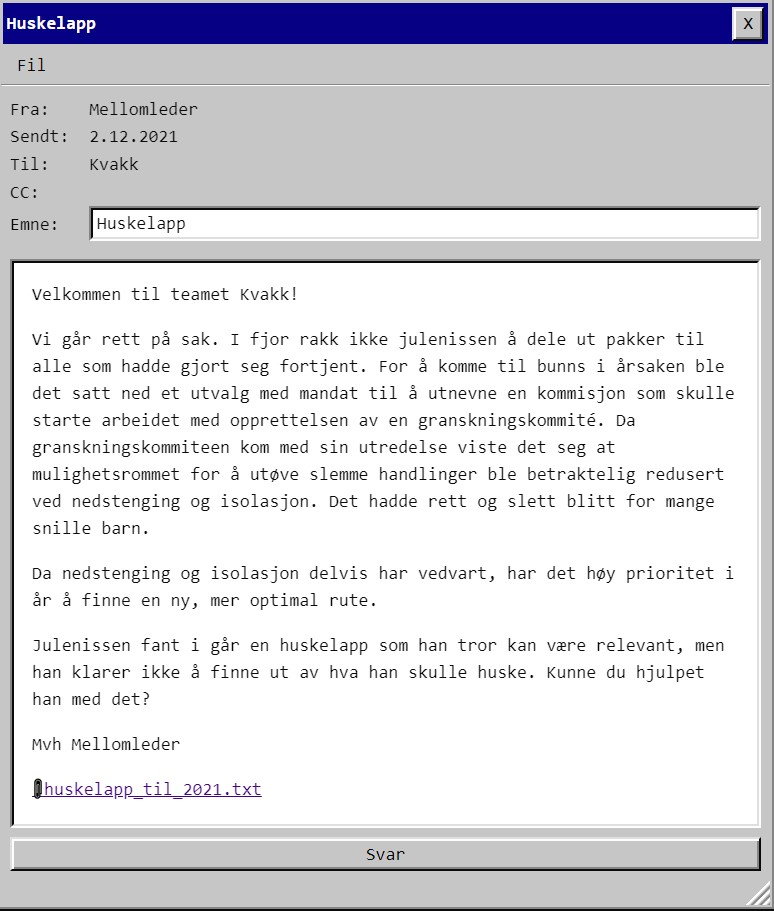
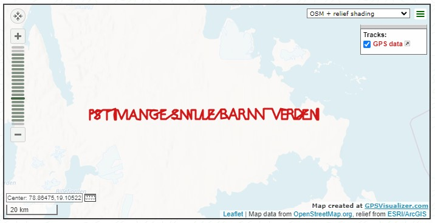

# Luke 2

Fikk en [CSV fil](huskelapp_til_2021.txt) med noe som så ut som koordinater - men med mellomrom her og der.

Jeg prøvde å knote i python med plotly, men noen av bokstavene ble helt merkelige. Ble tipset om å plotte med et [online verktøy](https://www.gpsvisualizer.com/map_input?form=data) i stedet.

Skrev om python-scriptet mitt til å hoste opp koordinater jeg kunne paste inn der i stedet:

    #!/usr/bin/env python3
    data = eval(open("huskelapp_til_2021.txt").read())
    print("latitude,longitude")
    for elem in data:
        if elem:
        print("{},{}".format(elem[0],elem[1]))

    PST{mange snille barn i verden}