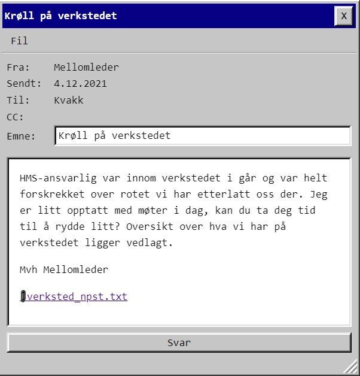
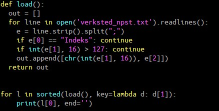

# Luke 4

Møkk. En CSV fil jeg skal prøve å dra noe vettugt ut av. Innser at jeg hater slike oppgaver :)

       Indeks;Hylleplass;Utstyr;Id
       1;153a;justerbar skiftenøkkel_str_01;1629
       2;132;justerbar skiftenøkkel_str_02;1356
       3;7b;justerbar skiftenøkkel_str_03;1379
       4;126;justerbar skiftenøkkel_str_04;1069
       ...

Prøvde alt mulig rart med denne, men jeg var ikke i stand til å dra ut en algoritme som ga lesbare bokstaver for hver linje. Etter en stund ga jeg opp, og filtrerte vekk det som ikke var lesbart - primært med utgangspunkt i hylleplass siden jeg så 0x7b ("{") der.

Det ga meg **{DdFRot}TetBlortPiUrS** og da begynner vi å snakke. Riktig antall krøllparantes, og noe som ligner på norske ord.

Jeg prøvde manuell sortering først, men gikk meg litt fast i at det første jeg så var "Rotet" og "Bort" og det viste seg å være feil ord.
Fikk et tips om sorteringen og prøvde med verktøynavn som sorteringsnøkkel. Jeg hadde prøvd å bruke verktøynavn som alt mulig annet, men ikke akkurat det :)

    PST{DetBlirFortRot}
