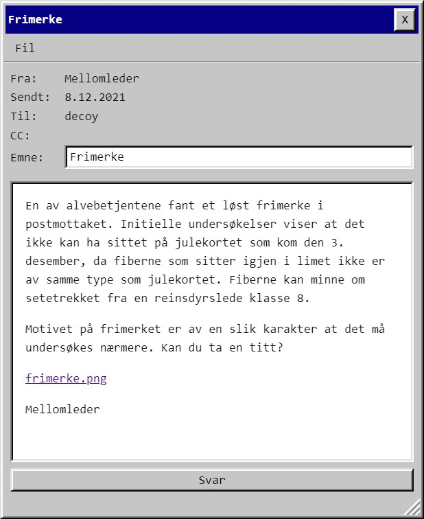
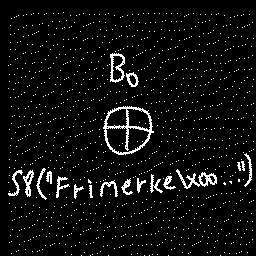
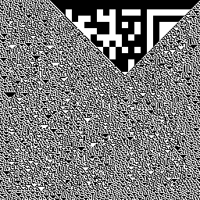
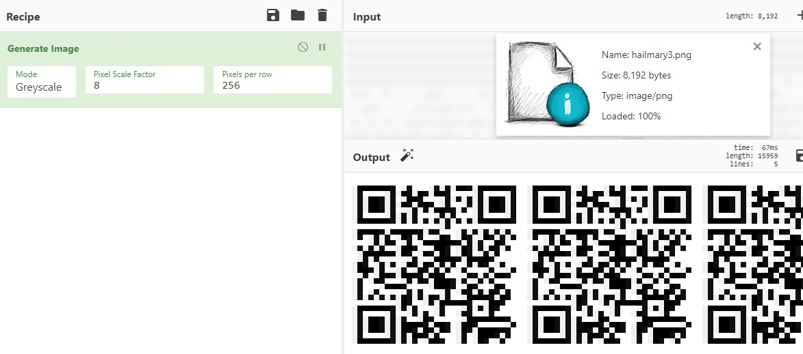
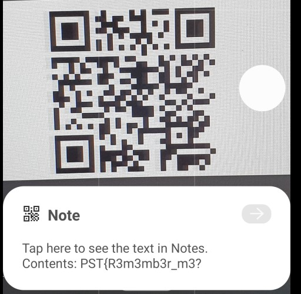
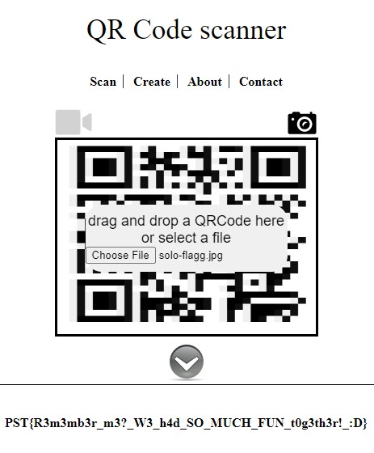

# Luke 8



Jadda. Trodde første det var noe morsomt med tetris-greiene, men så heldige var vi ikke. Brukte [StegOnline](https://stegonline.georgeom.net/) til å dra ut info fra bildet. Fant en oppgavebeskrivelse i bitplan rød-0 og i bitplan blå-0 var det tydelig noe snadder med rester av en QR:

| rød-0 | blå-0 |
| --- | --- |
|  | 

Tolket det til at jeg skal ta frame blå-0 og XORe det med... noe. Slede8 er nevnt her, i hint i mailen ("reinsdyrsledeklasse 8") og det står "SLEDE8" i klartekst i bitplan grønn-0. Men jeg kan ingenting om Slede8. Heldigvis fikk jeg omsider tips fra en som var med i fjor, og har fått en introduksjon til Slede8 på normalt vis, om at g0 var en Slede8-kompilert binærfil.

Siden jeg har smått fryktet å bli introdusert til slede8 så hadde jeg lest litt om det, og husket å ha sett en emulator i [UnblvR sine writeups](https://github.com/myrdyr/ctf-writeups/tree/master/npst20). Modifiserte runner.py til å ta min g0-fil og "Frimerke" med 0-padding (jeg prøvde hex-versjon av "Frimerke" også, men da gikk noe galt):

```python
...
rom = open("drit.s8", "rb").read()
inp = b"Frimerke" + b"\0"*40

assert rom.startswith(b".SLEDE8")
cpu = CPU(rom=rom[7:], inp=inp)
cpu.run()
open("s8-frame.out", "wb").write(cpu.out)
```

40*null bak der er bare "stort nok" buffer. Jeg prøvde bare "Frimerke" først, men fikk feilmeldinger om at programmet gikk tom for føde, så jeg la på litt.

Fikk til slutt en binærfil jeg kunne XORe med data fra frame blå-0. 

```python
from pwn import xor
open("hailmary3.png", "wb").write( 
    xor(
        open("b0.png", "rb").read(), 
        open("s8-frame.out", "rb").read()
        )
    )
```

Resultatet puttet jeg i Chef og ba den generere et bilde med det som utgangspunkt:



Prøvde først å scanne med mobilen:



Men her var det noe muffens. Denne koden fikk jeg ikke levert. Siden andre hadde fått det til, og jeg åpenbart var på riktig vei, prøvde jeg å klippe ut en av QR-kodene å fø til en online-leser i stedet:



    PST{R3m3mb3r_m3?_W3_h4d_SO_MUCH_FUN_t0g3th3r!_:D}


