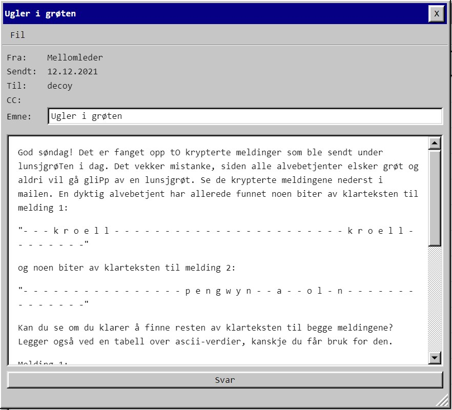

# Luke 12



Klartekst 1:
```
- - - k r o e l l - - - - - - - - - - - - - - - - - - - - - - - k r o e l l - - - - - - - -
```

Klartekst 2: 
```
- - - - - - - - - - - - - - - - p e n g w y n - - a - - o l - n - - - - - - - - - - - - - -
```

Meldingene: 
```
Melding 1:

00010101 00010100 00010011 00000000 00011101 00000011 00001010 00000010 00011100 00000011 00010101 00011001 00010111 00000001 00010001 00001001 00011111 00010010 00000100 00000000 00001001 00000111 00011010 00000000 00000001 00001110 00000000 00010101 00001011 00011111 00010000 00011000 00000000 00000000 00000000 00000000 00000000 00000000 00000000 00000000 00000000 00000000 00000000 00000000 00000000 00000000

Melding 2:

00010110 00001100 00000110 00000111 00001000 00000101 00001101 00001011 00000011 00011000 00011110 00001110 00010110 00001001 00010111 00001101 00011100 00010101 00001111 00010101 00010010 00010111 00011010 00001010 00011110 00000100 00000110 00000111 00001010 00000000 00010000 00000100 00011000 00011001 00000110 00001011 00000010 00001001 00000010 00001000 00011111 00001010 00011100 00010011 00000000 00011101
```

Her hintes det om OTP i teksten, så begge meldingene er kryptert med samme nøkkel. XOR av klarteksten med tilsvarende melding vil da gi nøkkelen, og basert på flaggformatet kan vi gjette enda mer av klarteksten:
```
p s t k r o e l l p a r e n t e s - - - - - - - - - - - - - - - k r o e l l p a r e n t e s
- - - - - - - - - - - - - - - - p e n g w y n - - a - - o l - n - - - - - - - - - - - - - -

```

Og da begynner det å bli ganske lite ukjent igjen. Skrev et lite python-script for å lage en nøkkel.

```python
c1 = [int(ch, 2) for ch in "00010101 00010100 00010011 00000000 00011101 00000011 00001010 00000010 00011100 00000011 00010101 00011001 00010111 00000001 00010001 00001001 00011111 00010010 00000100 00000000 00001001 00000111 00011010 00000000 00000001 00001110 00000000 00010101 00001011 00011111 00010000 00011000 00000000 00000000 00000000 00000000 00000000 00000000 00000000 00000000 00000000 00000000 00000000 00000000 00000000 00000000".split()]
c2 = [int(ch, 2) for ch in "00010110 00001100 00000110 00000111 00001000 00000101 00001101 00001011 00000011 00011000 00011110 00001110 00010110 00001001 00010111 00001101 00011100 00010101 00001111 00010101 00010010 00010111 00011010 00001010 00011110 00000100 00000110 00000111 00001010 00000000 00010000 00000100 00011000 00011001 00000110 00001011 00000010 00001001 00000010 00001000 00011111 00001010 00011100 00010011 00000000 00011101".split()]

p1 = "pstkroellparentes" + " "*15 + "kroellparentes"
p2 = " " * 16 + "pengwyn  a  ol n" + " "*14
key = [0]*len(c1)
for i in range(0, len(c1)):
    if p2[i] != " ": key[i] = c2[i] ^ ord(p2[i])
    if p1[i] != " ": key[i] = c1[i] ^ ord(p1[i])

print("key: ", "".join([chr(k) for k in key]))

print("msg1: ", end='')
for i in range(len(c1)):
    print(chr(c1[i] ^ key[i]) , end='')
print()

print("msg2: ", end='')
for i in range(len(c1)):
    print(chr(  c2[i] ^ key[i] ), end='')
print()
```

Output: 
```
key:  eggkolonpstkroellparenteeljkroellparentes
msg1: pstkroellparentesberlinknsrkroellparentes
msg2: skalgibeskjedfrapengwyn
aolnskinnerimorgen
```

Close. Det ser ut som at nøkkelen skjuler et egg også, men flagget først. For nå går det an å gjette på hele msg1 for å løse oppgaven: pstkroellparentes**berlinerkranser**kroellparentes 

    pst{berlinerkranser}

Oppdater p1 i koden med mer plaintext og kjører på nytt:
```
key:  eggkolonpstkroellparentesertelujkroellparentes
msg1: pstkroellparentesberlinerkranserkroellparentes
msg2: skalgibeskjedfrapengwynomatsolenskinnerimorgen
```

Egget er altså juletre baklengs:
```
pst{erteluj}
```

