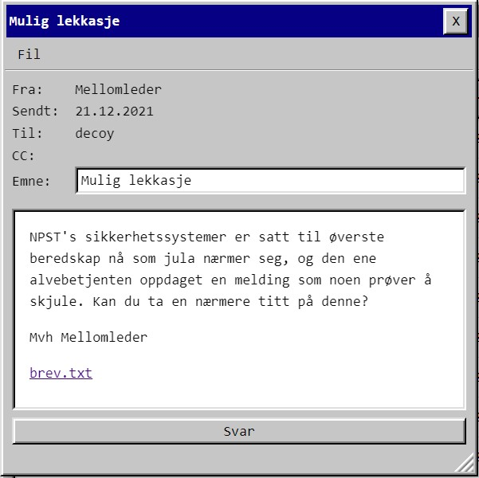

# Luke 21



Skjult tekst i [brev.txt](./brev.txt). vscode advarte kjapt om at det var skjult unicode her. 

En tur innom google ga lenke til en fin [CTF writeup](https://ctftime.org/writeup/11321) som pekte meg til en [en online decoder](https://330k.github.io/misc_tools/unicode_steganography.html) for zero-width unicode. Det ga litt bomskudd i starten til jeg faktisk inspiserte filen og så at det kun var u200C og u200D som var brukt:

```
Jeg har planen klar!
De har nettopp delt ut oversikt over hvor nissen må stoppe og mate reinsdyrene underveis på ruta.

Her er det muligheter for å ødelegge!
Jeg holder dere oppdatert

-M
PST{ReadingBetweenTheLetters}
```

    PST{ReadingBetweenTheLetters}


Note to self: Så i writeup fra UnblvR hvordan dette gjøres mye raskere fra Python:

```python
L = {'\u200c':'0', '\u200d':'1'}
F = int(''.join(L.get(e,'') for e in open("brev.txt").read()),2)
print(F.to_bytes((F.bit_length()+7)//8, "big").decode())
```

