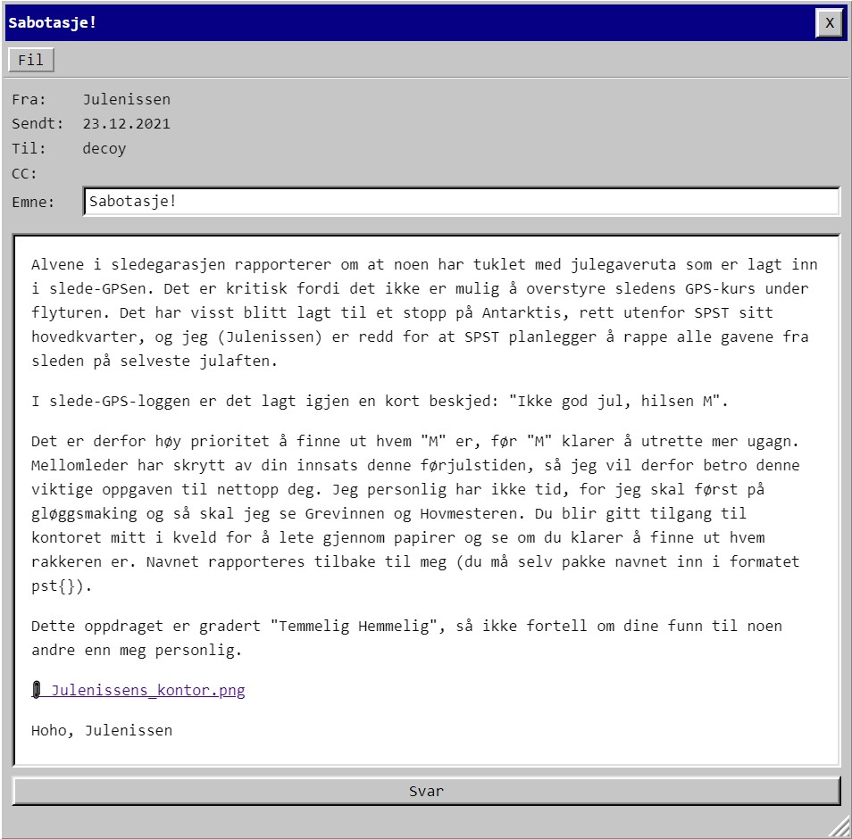

# Luke 23



Vedlagt [bilde](Julenissens_kontor.png). Kjørte zsteg først, og den sa at det var ekstra data etter bildeslutt. Binwalk snakker om txt og pdf:

```
DECIMAL       HEXADECIMAL     DESCRIPTION
--------------------------------------------------------------------------------
0             0x0             PNG image, 3840 x 2160, 8-bit/color RGBA, non-interlaced
41            0x29            Zlib compressed data, default compression
8808086       0x866696        Zip archive data, at least v2.0 to extract, uncompressed size: 2829558, name: julekort.png
8808165       0x8666E5        PNG image, 1920 x 1080, 8-bit/color RGBA, non-interlaced
8808219       0x86671B        Zlib compressed data, compressed
11638599      0xB19747        Zip archive data, at least v2.0 to extract, uncompressed size: 2173935, name: Barndomsfoto.png
11638682      0xB1979A        PNG image, 1920 x 1080, 8-bit/color RGBA, non-interlaced
11638736      0xB197D0        Zlib compressed data, compressed
13813293      0xD2C62D        Zip archive data, at least v2.0 to extract, uncompressed size: 1015, name: note_to_elf.txt
13813955      0xD2C8C3        Zip archive data, at least v2.0 to extract, uncompressed size: 120574, name: snille_og_slemme.pdf
13928231      0xD48727        End of Zip archive, footer length: 22
```
Inni var det en zipfil som pakket ut til:
* julekort.png
* Barndomsfoto.png
* note_to_elf.txt
* snille_og_slemme.pdf

Maximilian er den eneste som er ansatt i NPST, er snill og ikke har fått gave.

    pst{Maximilian}


# Egg!

I frame grønn på julekort.png er det et massivt hint:


Barndomsfoto.png lover ikke godt. [Blå-0 har bilde av kanin som hopper ned i et hull](kaninhull.jpg)

Mer tekst-strenger hentet fra Julekort.png:
* Grønn-1: "ikke tall men antall streker langs klokka..."
* Blå-0: "lang kort lang kort"
* Rød-1: "hvor peker klokka mon tro."
* Rød-0: "tikk... takk... tikk... takk..."

Mye hint om klokker her.

Streker på klokka.
5 langviser
15 kortviser
6 langviser
20 kortviser

5 15 6 20 .. 515620

Gikk ned mange rare kaninhull, men prøvde til slutt å bare poste de tallene:

    PST{egg_515620}

