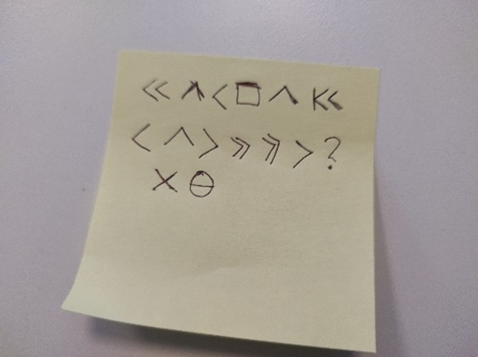

# International

## Mail
* mail til ip.madrid@opholmgang.com gir oss 
  * PDF som ikke ser ut til å ha noe ekstra-innhold
  * Kryptert zip-fil med excel-ark (passord til denne er flagget)
  * PDFen sier at passordet er bak et bilde i kroatia

* Mail til ip.zagreb@opholmgang.com
  * Ikke noe funnet. Nevner bil med reg.nr PEV 087

### PEV 087
> Belgium (until 2010), Cyprus, Finland, Georgia (until 2014), Hungary (1990-2022), Lithuania, Malta, Sweden (1974-2019), and Moldova (since 2014) each use combinations of first three letters and then three digits.

* Mail til ip.budapest@opholmgang.com
  * test-mailen kom frem, men de forstod den ikke. Måtte sende med bilnummeret i meldingen - de har tenkt på bruteforcing ;)
  * >Please ble adviced that the car with Hungarian licence plate PEV-087 is a red Toyota Camry with VIN: JTMMC118030J00242876 registred on the german company Schmidt & Söhne 
  * VIN-nummeret er for langt til at det fungerer i en online-oppslagstjeneste.

Schmidt & Söhne er et bilselskap i Celle, en liten by øst for Hanover. De er en VW-sjappe.

https://www.google.com/maps/place/Autohaus+Schmidt+%26+S%C3%B6hne+GmbH+%26+Co.KG/@52.6381412,9.5565633,9.25z/data=!4m5!3m4!1s0x0:0x2780b95d574e7738!8m2!3d52.6180112!4d10.0747872

Post til ip.berlin@ fungerte ikke, men websiden til [Interpol Tyskland](https://www.interpol.int/en/Who-we-are/Member-countries/Europe/GERMANY#:~:text=The%20INTERPOL%20National%20Central%20Bureau,globe%20in%20tackling%20transnational%20crime.) gir et hint

> The Federal Criminal Police Office - called ‘Bundeskriminalamt’ (BKA) - serves as Germany’s INTERPOL NCB.  It is staffed by some 6,300 men and women working in three different cities: Wiesbaden, Berlin and Meckenheim.

* Mail til ip.wiesbaden@opholmgang.com fikk svar
  * > Local police informs us that they searched the company headquarters yesterday and Hungarian registered car with license plate nr. PEV-087 was on the premises. In the car there was a wedding-photo with a note on the back. Photo of the note is attached.

## Lappen

Googlet meg blå på symbol-cipher til jeg begynte å manuelt gå igjennom hele listen til decode.fr, og fant https://www.dcode.fr/webdings-font

> 753159354884sry             

